# 图形中的数据结构

某些数据结构似乎在图形应用程序中反复弹出，也许是因为它们处理了诸如表面，空间和场景结构之类的基础概念。本章讨论最常见和最有用的几种基本的和不相关的数据结构类别：网格结构，空间数据结构，场景图和平铺的多维数组。
对于网格，我们讨论了用于存储静态网格并将网格传输到图形API的基本存储方案。我们还讨论了翼状边缘数据结构（Baumgart，1974年）和相关的半边缘结构，它们对于管理细分化（例如细分或模型简化）发生变化的模型很有用。尽管这些方法可以推广到任意多边形网格，但在这里我们只关注三角网格的简单情况。
接下来，给出场景图数据结构。这种数据结构的各种形式在图形应用程序中无处不在，因为它们在管理对象和转换中非常有用。所有新的图形API均旨在很好地支持场景图。
对于空间数据结构，我们讨论了在3D空间中组织模型的三种方法-边界体积层次结构，分层空间细分和统一空间细分-以及使用分层空间细分（BSP树）进行隐藏表面去除的方法。相同的方法也可用于其他目的，包括几何剔除和碰撞检测。
最后，介绍了平铺的多维数组。最初开发该应用程序是为了在需要从磁盘交换图形数据的应用程序中提高分页性能，而如今，这种结构对于计算机上的内存位置至关重要，无论该阵列是否适合主内存。

## 12.1 三角形网格

大多数现实世界的模型都是由共享顶点的三角形复合体组成的。这些通常称为三角网格，三角网格或三角不规则网络（TIN），有效地处理它们对于许多图形程序的性能至关重要。重要的效率类型取决于应用程序。网格存储在磁盘和内存中，我们希望最大程度地减少消耗的存储空间。当跨网络或从CPU到图形系统传输网格时，它们会消耗带宽，这通常比存储更宝贵。在对网格执行操作的应用程序中，除了简单地存储和绘制网格（例如细分，网格编辑，网格压缩或其他操作）外，有效访问邻接信息也至关重要。
三角形网格通常用于表示曲面，因此网格不仅是不相关的三角形的集合，而且是三角形的网络，这些三角形通过共享的顶点和边相互连接以形成单个连续表面。这是有关网格的关键见解：与收集相同数量的不相关三角形相比，可以更有效地处理网格。
三角形网格所需的最少信息是一组三角形（三个顶点）及其顶点的位置（在3D空间中）。但是，即使不是大多数，许多程序也需要能够在顶点，边缘或面上存储其他数据的功能，以支持纹理映射，着色，动画和其他操作。顶点数据是最常见的：每个顶点可以具有材质参数，纹理坐标和辐照度-值在整个曲面上变化的任何参数。然后，将这些参数线性插值到每个三角形上，以在网格的整个表面上定义连续函数。但是，偶尔能够存储每个边缘或每个面的数据也很重要。

### 12.1.1 网格拓扑

网格状表面的想法可以形式化为对网格拓扑的约束，即三角形连接在一起的方式，而无需考虑顶点位置。在具有可预测的连接性的网格上，许多算法只能工作，或者更容易实现。对网格拓扑的最简单，最严格的要求是使表面成为歧管。流形网格是“水密的” —无间隙，将表面内侧的空间与外侧的空间分隔开。它看起来也像网格上任何地方的表面。
歧管一词来自拓扑学的数学领域：粗略地说，歧管（特别是二维歧管或2流形）是一个表面，其中任何点周围的小邻域都可以平滑成一点平坦的表面。反例最清楚地说明了这种想法：如果网格的一条边上连接了三个三角形，则该点上的点的邻域与其中一个三角形内部的点之一的邻域不同，因为它上面有一个额外的“鳍”（图12.1）。如果边缘上恰好有两个三角形相连，则边缘上的点就象内部的点一样具有邻域，而中间只有一个折痕。同样，如果共享顶点的三角形的配置类似于图12.2中的左侧，则邻域就像是在中心将两块表面粘合在一起的表面，如果不加倍将其展平。右侧显示较简单邻域的顶点就很好。
许多算法都假设网格是多方面的，因此，如果将格式错误的网格作为输入，验证此属性以防止崩溃或无限循环始终是一个好主意。该验证归结为通过验证以下条件来检查所有边是否为流形，并检查所有顶点是否为流形：

•每个边缘正好由两个三角形共享。
•每个顶点周围都有一个完整的三角形循环。

图12.1说明了边如何通过具有太多的三角形而使第一次测试失败，而图12.2说明了顶点如何通过将两个独立的三角形环连接到顶点而使第二次测试失败。
流形网格很方便，但有时必须让网格具有边缘或边界。这样的网格不是流形的-边界上的点的邻域在一侧被切除。它们不一定是水密的。但是，我们可以将流形网格的要求放宽到有边界流形的要求，而不会引起大多数网格处理算法的问题。宽松的条件是：
•每个边缘由一个或两个三角形使用。
•每个顶点都连接到一组边连接的三角形。
图12.3说明了这些条件：从左到右，有一个带有一个三角形的边，一个顶点，其相邻的三角形在一个边连接的集合中，以及一个顶点，其中连接了两个不连续的三角形。

最后，在许多应用中，重要的是要能够将表面的“前”或“外部”与“背面”或“内部”区分开来，这就是所谓的表面方向。对于单个三角形，我们根据顶点的排列顺序定义方向：前面是三角形的三个顶点按逆时针方向排列的一侧。相连的网格是一对方向一致的三角形，两个共享的顶点在两个三角形的顶点列表中以相反的顺序显示（图12.4）。重要的是方向的一致性-一些系统使用顺时针而不是逆时针顺序定义正面。
具有非流形边缘的任何网格都无法一致地定向。但是，网格也可能是具有边界的有效流形（甚至流形），但没有一致的方式来定向三角形-它们不是可定向的表面。一个例子是图12.5所示的莫比乌斯带。但是，实际上这很少是一个问题。

### 12.1.2 索引网状存储

一个简单的三角形网格如图12.6所示。 您可以将这三个三角形存储为独立的实体，每种形式如下：

```
Triangle {
    vector3 vertexPosition[3]
}
```

这将导致顶点b的存储次数为三次，其他顶点的存储次数为两次，总共存储了九个点（三个三角形中的每个顶点有三个顶点）。 或者，您也可以安排共享公共顶点并仅存储四个顶点，从而形成共享顶点网格。 从逻辑上讲，此数据结构具有三角形，这些三角形指向包含顶点数据的顶点：

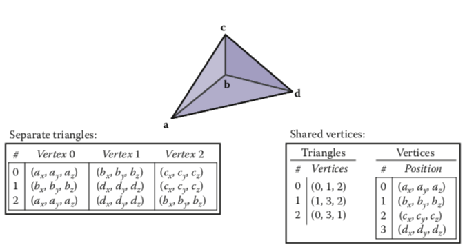

<center>图12.6。 具有四个顶点的三三角形网格，分别由单独的三角形（左）和共享顶点（右）表示</center>
```
Triangle {
  Vertex v[3]
}
Vertex {
  vector3 position  // or other vertex data
}

```

注意，v数组中的条目是对Vertex对象的引用或指针。 顶点不包含在三角形中。
在实现中，顶点和三角形通常存储在数组中，三角形到顶点的引用通过存储数组索引来处理：

```
IndexedMesh {
    int tInd[nt][3]
    vector3 verts[nv]
}
```

在tInd [i] [k]中可以找到第i个三角形的第k个顶点的索引，并且该顶点的位置存储在verts数组的相应行中； 有关示例，请参见图12.8。 这种存储共享顶点网格的方式是索引三角形网格。
单独的三角形或共享的顶点都可以正常工作。 共享顶点有空间优势吗？ 如果我们的网格具有nv个顶点和nt个三角形，并且假设浮点，指针和整数的数据都需要相同的存储（可疑的假设），则空间要求如下：

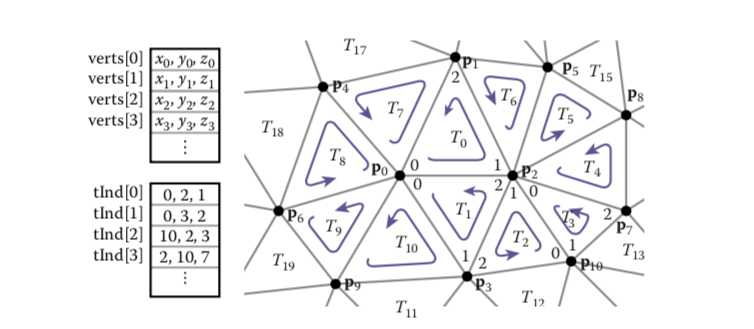

<center>图12.8。 较大的三角形网格，其一部分表示为索引三角形网格。</center>
• 三角形。 每个三角形三个向量，存储9nt单位；
•IndexedMesh。 每个顶点一个向量，每个三角形三个整数，表示3nv +
3nt的存储单位。
相对存储要求取决于nt与nv的比率。
根据经验，一个大网格的每个顶点都连接到大约六个三角形（尽管在极端情况下可以有任意数量）。 由于每个三角形都连接到三个顶点，因此这意味着大三角形中的三角形通常是顶点的两倍：nt≈2nv。 进行此替换后，我们可以得出结论，三角形结构的存储需求为18nv，IndexedMesh的存储需求为9nv。 使用共享顶点可以将存储需求减少大约两倍。 这似乎在大多数实现中都适用。

### 12.1.3 三角带和风扇

索引网格是三角形网格的最常见的内存表示形式，因为它们实现了简单性，便利性和紧凑性之间的良好平衡。它们通常还用于在网络上以及应用程序和图形管道之间传输网格。在需要更高紧凑性的应用中，可以使用三角带和三角扇更有效地表示三角形顶点索引（在索引网格中仅占据顶点位置的位置占据三分之二的空间）。
三角形风扇如图12.9所示。在索引网格中，三角形数组将包含[（0，1，2），（0，2，3），（0，3，4），（0，4，5）]。尽管只有六个不同的顶点，但我们正在存储12个顶点索引。在三角形风扇中，所有三角形共享一个共同的顶点，而其他顶点生成一组三角形，就像可折叠风扇的叶片一样。可以用序列[0、1、2、3、4、5]指定图中的风扇：第一个顶点确定中心，然后每对相邻的顶点（1-2、2-3等）建立。 ）创建一个三角形。
三角形条带是一个类似的概念，但是对于更大范围的网格很有用。在这里，顶点以线性带状的顶部和底部交替添加，如图12.10所示。图中的三角形带可以由序列[0 1 2 3 4 5 6 7]指定，三个相邻顶点（0-1-2、1-2-3等）的每个子序列都会创建一个三角形。为了保持一致的方向，每个其他三角形都需要颠倒顺序。在此示例中，这将导致三角形（0、1、2），（2、1、3），（2、3、4），（4、3、5）等。对于每个出现的新顶点，最旧的顶点被遗忘，其余两个顶点的顺序被交换。较大的示例请参见图12.11。

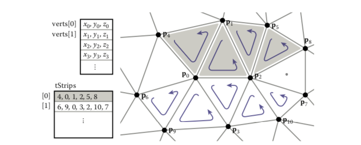

<center>图12.11在较大网格中的两个三角形条。 请注意，两个条都不能扩展为包括标有星号的三角形。</center>
在条带和扇形中，n + 2个顶点足以描述n个三角形，这比标准索引网格所需的3n个顶点节省了很多。 如果程序是顶点绑定的，则长三角带将节省大约三倍的空间。
看起来三角形条仅在条非常长时才有用，但即使是相对较短的条也已经获得了大多数好处。 节省的存储空间（仅用于顶点索引）如下：

|   带长   |  1   |  2   |  3   | 4    |  5   |  6   |  7   |  8   |  16  | 100  | 无穷 |
| :------: | :--: | :--: | :--: | ---- | :--: | :--: | :--: | :--: | :--: | :--: | :--: |
| 关联大小 | 1.00 | 0.67 | 0.56 | 0.50 | 0.47 | 0.44 | 0.43 | 0.42 | 0.38 | 0.34 | 0.33 |

因此，实际上，随着试纸条长度的增加，回报率会迅速下降。 因此，即使对于非结构化的网格，也值得使用一些贪心算法将它们聚集成短条。

### 12.1.4网状连接的数据结构

索引网格，条带和扇形都是静态网格的良好紧凑表示。 但是，它们不容易允许修改网格。 为了有效地编辑网格，需要更复杂的数据结构来有效地回答查询，例如：
•给定一个三角形，三个相邻的三角形是什么？

•给定一条边，哪个三角形共享它？

•给定一个顶点，哪个面共享它？
•给定一个顶点，哪些边共享它？
三角形网格，多边形网格和带孔的多边形网格有许多数据结构（请参阅本章末尾的注释以获取参考）。 在许多应用中，网格非常大，因此有效的表示至关重要。
最简单的实现方式虽然很肿，但将具有三种类型：Vertex，Edge和Triangle，并直接存储所有关系：

```
  Triangle {
    Vertex v[3]
    Edge e[3]
}
  Edge {
    Vertex v[2]
    Triangle t[2]
}
  Vertex {
    Triangle t[]
    Edge e[]
}
```

这使我们可以直接查找上述连通性问题的答案，但是由于此信息都是相互关联的，因此它存储的内容超出了实际需要。同样，在顶点中存储连接性会导致长度可变的数据结构（因为顶点可以具有任意数量的邻居），这通常实现起来效率较低。与其承诺明确地存储所有这些关系，不如定义一个类接口来回答这些问题，而在这之后可以隐藏更有效的数据结构。事实证明，我们只能存储一些连接性，并在需要时有效地恢复其他信息。
Edge和Triangle类中的固定大小的数组表明，在此处存储连接信息将更加有效。实际上，对于多边形具有任意数量的边和顶点的多边形网格，只有边具有固定大小的连通性信息，这导致许多传统的网格数据结构基于边。但是对于仅三角形的网格，将连通性存储在（数量较少的）面上是很吸引人的。
良好的网格数据结构应合理紧凑，并能有效回答所有邻接查询。高效意味着恒定的时间：寻找邻居的时间不应取决于网格的大小。我们将研究三种网格数据结构，一种基于三角形，另一种基于边缘。

<font color=#51537F>三角邻结构</font>

通过使用从三角形到三个相邻三角形的指针以及从每个顶点到相邻三角形之一的指针来扩展基本共享顶点网格，我们可以基于三角形创建紧凑的网格数据结构。 ）; 参见图12.12：

```
Triangle {
   Triangle nbr[3];
   Vertex v[3];
}
Vertex {
// ... per-vertex data ... 
Triangle t; // any adjacent tri
}
```

在数组Triangle.nbr中，第k个入口指向共享顶点k和k + 1的相邻三角形。我们将此结构称为三角形-邻居结构。 从标准索引网格阵列开始，可以用两个附加阵列来实现：一个阵列存储每个三角形的三个邻居，另一个阵列存储每个顶点的单个相邻三角形（示例请参见图12.13）：

```
Mesh {
// ... per-vertex data ...
int tInd[nt][3]; // vertex indices
int tNbr[nt][3]; // indices of neighbor triangles
int vTri[nv]; // index of any adjacent triangle
}
```

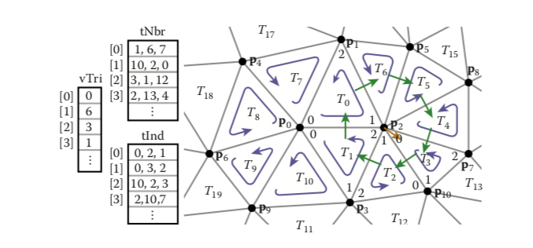

<center>图12.11以数组编码的三角形相邻结构，以及遍历顶点2的相邻三角形所遵循的顺序。</center>
显然，可以在数据结构中直接找到相邻的三角形和三角形的顶点，但是通过仔细使用此三角形邻接信息，还可以在恒定时间内回答有关顶点的连接性查询。 想法是从三角形移动到三角形，仅访问与相关顶点相邻的三角形。 如果三角形t的顶点v为第k个顶点，则三角形t.nbr [k]是顺时针方向上v周围的下一个三角形。 这种观察导致以下算法遍历与给定顶点相邻的所有三角形：

```
TrianglesOfVertex(v) { 
	t = v.t
	do {
		find i such that (t.v[i] == v) 
			t = t.nbr[i]
   } while (t != v.t)
}
```

此操作可以在恒定的时间内找到每个后续的三角形-即使需要进行搜索以找到每个三角形的顶点列表中中心顶点的位置，但顶点列表的大小是恒定的，因此搜索需要恒定的时间。 但是，该搜索很麻烦，并且需要额外的分支。
一个小的改进可以避免这些搜索。 问题在于，一旦我们将指针从一个三角形指向另一个三角形，我们就不知道从哪个方向来：我们必须搜索该三角形的顶点以找到连接回到上一个三角形的顶点。 为了解决这个问题，我们可以通过存储带有指针的索引来存储指向这些三角形的特定边的指针，而不是存储指向相邻三角形的指针：

```
Triangle {
   Edge nbr[3];
   Vertex v[3];
}
Edge { // the i-th edge of triangle t Triangle t;
   int i;  // in {0,1,2}
}
Vertex {
		// ... per-vertex data ...
		Edge e; // any edge leaving vertex
}

```

在实践中，通过从三角形索引t借用两位存储来存储边缘索引i，从而存储边缘，因此总存储需求保持不变。

在这种结构中，三角形的相邻数组可以告诉相邻三角形中哪些边与该三角形的三个边共享。 有了这些额外的信息，我们总是知道在哪里可以找到原始三角形，从而导致数据结构不变：对于任何三角形t的第j个边，
$$
t.nbr[j].t.nbr[t.nbr[j].i].t == t.
$$
知道我们经过哪个边后，我们可以立即知道要离开哪个边，以便继续在顶点上遍历，从而得到流线型算法：

```
TrianglesOfVertex(v) { 
		{t, i} = v.e;
		do {
      {t, i} = t.nbr[i];
      i = (i+1) mod 3;
   } while (t != v.e.t);
}
```

三角形相邻结构非常紧凑。 对于只有顶点位置的网格，我们每个顶点存储四个数字（三个坐标和一个边），每个面存储六个（三个顶点索引和三个边），每个顶点总共存储4nv + 6nt≈16nv个单位， 与基本索引网格的9nv相比。
此处显示的三角形邻居结构仅适用于流形网格，因为它依赖于返回起始三角形来终止顶点邻居的遍历，这种情况不会发生在没有完整三角形周期的边界顶点上。 但是，通过为边界三角形的邻居引入合适的前哨值（例如-1）并注意边界顶点指向最逆时针的相邻三角形，而不是将其推广到带边界的流形，并不难。 任何任意三角形。

<font color=#51537F>翼状结构</font>

一种广泛使用的网格数据结构是翼状边缘数据结构，该结构在边缘而不是在面处存储连接性信息。 这种数据结构使边缘成为数据结构的一等公民，如图12.14和12.15所示。
在有翼边的网格中，每个边都存储指向它所连接的两个顶点（头和尾顶点），它所属于的两个面（左右面）以及最重要的是下一个和第二个面的指针。 左右面逆时针遍历的前边缘（图12.16）。 每个顶点和面还存储指向与其连接的单个任意边的指针：

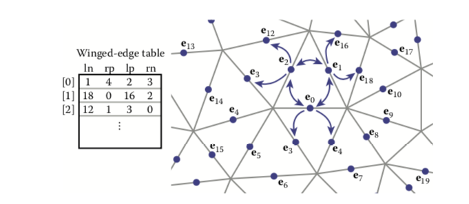

<center> 图12.14翼状边缘网格结构示例，存储在数组中</center>
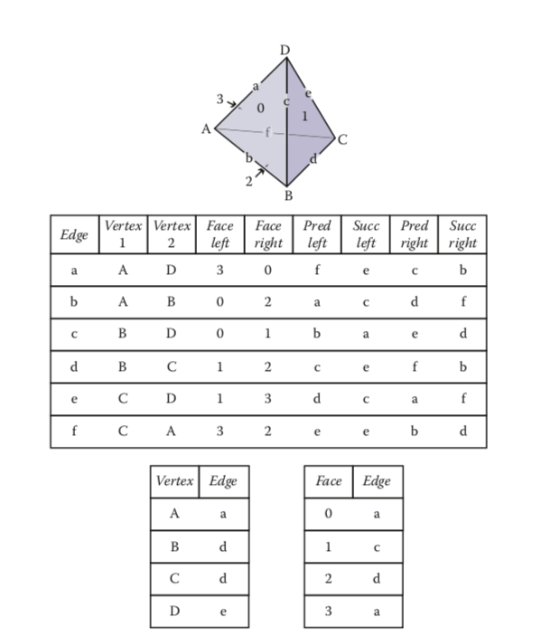

<center>图12.15四面体和有翼数据结构的相关元素。 这两个小表不是唯一的。 每个顶点和面都存储与之关联的任何一条边。</center>
```
Edge {
	Edge lprev, lnext, rprev, rnext; 
	Vertex head, tail;
	Face left, right;
}
Face {
	// ... per-face data ...
	Edge e; // any adjacent edge
}
Vertex {
	// ... per-vertex data ... 
	Edge e; // any incident edge
}
```

翼状边缘数据结构支持对面或顶点的边缘进行恒定时间访问，从这些边缘可以找到相邻的顶点或面：

```
EdgesOfVertex(v) { 
	 e = v.e;
   do {
      if (e.tail == v)
         e = e.lprev;
      else
         e = e.rprev;
   } while (e != v.e);
}
EdgesOfFace(f) {
   e = f.e;
   do {
      if (e.left == f)
         e = e.lnext;
      else
         e = e.rnext;
   } while (e != f.e);
}
```

在不限于三角形的多边形网格中，这些相同的算法和数据结构同样可以很好地工作。 这是基于边缘的结构的重要优势之一。
与任何数据结构一样，有翼数据结构会进行各种时间/空间折衷。 例如，我们可以消除上一个参考。 这使得围绕面顺时针遍历或围绕顶点逆时针遍历变得更加困难，但是当我们需要知道前一条边时，我们总是可以沿一个圆跟随后继边，直到回到原始边为止。 这样可以节省空间，但是会使某些操作变慢。 （有关这些折衷的更多信息，请参见本章说明）。

<font color=#51537F>半边结构</font>

翼状边缘结构非常优雅，但还有一个尴尬之处-需要在移动到下一个边缘之前不断检查边缘的定向方式。该检查与我们在三角形邻居结构的基本版本中看到的搜索直接相似：我们正在寻找要查找的是从头还是尾输入当前边。该解决方案几乎也无法区分：我们不是为每个边缘存储数据，而是为每个半边缘存储数据。两个三角形中的每一个共享一条边，每个三角形都有一个半边，两个半边的方向相反，每个边与自己的三角形一致。
通常存储在边缘中的数据在两个半边缘之间分配。每个半边沿在边的一侧指向面，并在其头部指向顶点，并且每个半边都包含其面的边指针。它还指向边缘另一侧的邻居，从中可以找到另一半信息。像有翼的边缘一样，半边可以包含指向其周围的前一个和下一个半边缘的指针，或者仅指向下一个半边缘的指针。我们将显示使用单个指针的示例。

```
HEdge {
   HEdge pair, next;
   Vertex v;
   Face f;
}
Face {
	 // ... per-face data ...
	 HEdge h; // any h-edge of this face
}
Vertex {
	 // ... per-vertex data ...
	 HEdge h; // any h-edge pointing toward this vertex
}

```

遍历半边结构就像遍历有翼边结构一样，只不过我们不再需要检查方向，并且遵循对指针来访问相反面上的边。

```
EdgesOfVertex(v) {
   h = v.h;
   do {
      h = h.pair.next;
   } while (h != v.h);
}
```

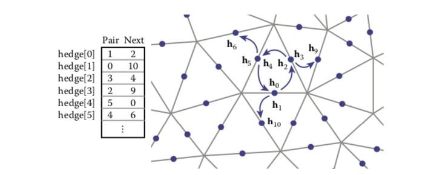

<center>图12.18。 存储在数组中的半边网格结构的示例。</center>
```
EdgesOfFace(f) {
   h = f.h;
   do {
      h = h.next;
   } while (h != f.h);
}
```

此处的顶点遍历是顺时针方向，这是必需的，因为从结构中省略了上一个指针。
由于半边通常是成对分配的（至少在没有边界的网格中），因此许多实现都可以消除对指针。 例如，在基于数组索引的实现中（例如，图12.18所示），可以对数组进行排列，以使偶数边i始终与边i + 1成对，而奇数边i始终与边i +成对。 边j − 1。
除了本章中显示的简单遍历算法之外，所有这三种网格拓扑结构都可以支持各种“网格手术”操作，例如拆分或折叠顶点，交换边，添加或删除三角形等。

##12.2 场景图

三角形网格管理构成场景中对象的三角形的集合，但是图形应用程序中的另一个普遍问题是将对象布置在所需位置。 正如我们在第6章中看到的那样，这是使用转换完成的，但是复杂的场景可以包含很多转换，并且组织得当可以使场景更易于操纵。 大多数场景都接受层次结构的组织，并且可以使用场景图根据此层次结构来管理转换。

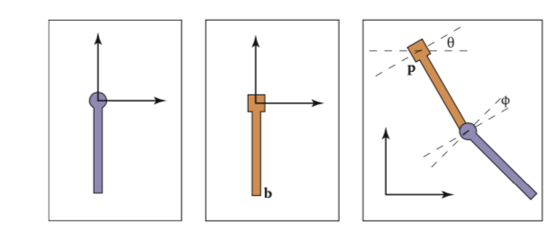

<center>图12.19。 铰链摆。 左侧是其“局部”坐标系中的两个部分。 底部部件的铰链位于点b，底部部件的附件位于其本地原点。 组装物体的自由度是角度（θ，φ）和顶部铰链的位置p。</center>
为了激发场景图数据结构，我们将使用图12.19所示的铰链摆。 考虑一下我们如何绘制钟摆的顶部：
$$
\begin{align}
&M_1 = rotate(θ)\\
&M_2 = translate(p)\\
&M_3 = M_2M_1\\
&Apply\quad M_3\quad to\quad all\quad points\quad in\quad upper\quad pendulum
\end{align}
$$
底部更加复杂，但是我们可以利用以下事实：它在局部坐标系中的b点处附着到上摆的底部。 首先，我们旋转下摆，使其相对于其初始位置成角度。 然后，将其移动，使其顶部铰链位于b点。 现在它在上摆的局部坐标中的适当位置，然后可以与该坐标系一起移动。 下摆的复合变换为：
$$
\begin{align}
&M_a = rotate(θ)\\
&M_b = translate(p)\\
&M_c = M_bM_a\\
&M_d = M_3M_c\\
&Apply\quad M_d\quad to\quad all\quad points\quad in\quad lower\quad pendulum
\end{align}
$$
因此，我们看到下摆不仅生活在自己的局部坐标系中，而且坐标系统本身也随上摆的坐标一起移动。
我们可以将钟摆编码为一种数据结构，使这些坐标系统问题的管理更加轻松，如图12.20所示。 适用于对象的适当矩阵只是从对象到数据结构根的链中所有矩阵的乘积。 例如，考虑一个轮渡的模型，该轮船具有可以在轮渡甲板上自由移动的汽车，以及每个相对于汽车移动的车轮，如图12.21所示。
与摆锤一样，每个对象都应通过从根到对象的路径中的矩阵乘积进行变换：

•使用M0进行轮渡变换；
•使用M0M1进行车身变换；
•使用M0M1M2进行左轮转换；
•使用M0M1M3进行左轮转换。

使用矩阵堆栈（一种由许多API支持的数据结构）可以实现有效的实现。 使用推和弹出操作对矩阵堆栈进行操作，这些操作从矩阵乘积的右侧添加和删除矩阵。 例如，调用：
$$
push(M_0) \\
push(M_1 ) \\
push(M_2 )\\
$$
创建活动矩阵M = M0M1M2。 随后对pop（）的调用将剥离最后添加的矩阵，以便活动矩阵变为M = M0M1。 将矩阵堆栈与场景图的递归遍历相结合，可以得到：

```
function traverse(node)
push(Mlocal )
draw object using composite matrix from stack 
traverse(left child)
traverse(right child)
pop()
```

场景图上有很多变体，但是都遵循上述基本思想。

## 12.3 空间数据结构

在许多（如果不是全部）图形应用程序中，在空间的特定区域中快速定位几何对象的能力很重要。光线追踪器需要找到与光线相交的对象。导航环境的交互式应用程序需要找到从任何给定视点可见的对象；游戏和物理模拟需要检测物体何时何地碰撞。所有这些需求都可以通过各种空间数据结构来支持，这些结构旨在组织空间中的对象，从而可以高效地查找它们。
在本节中，我们将讨论空间数据结构的三种通用类别的示例。将对象组合为一个层次结构的结构是对象划分方案：将对象划分为不相交的组，但这些组最终可能在空间上重叠。将空间划分为不相交的区域的结构是空间划分方案：将空间划分为单独的分区，但是一个对象可能必须与多个分区相交。空间划分方案可以是规则的，其中将空间划分为均匀形状的块，也可以是不规则的，其中将空间自适应地划分为不规则的块，其中较小的块中存在越来越多的对象。

在讨论这些结构时，我们将以光线跟踪为主要动机，尽管它们也都可以用于视图剔除或碰撞检测。 在第4章中，所有对象在检查相交时都被环回。 对于N个对象，这是O（N）线性搜索，因此对于大型场景来说很慢。 像大多数搜索问题一样，只要可以创建有序数据结构作为预处理，就可以使用“分而治之”技术在亚线性时间内计算射线与物体的交点。 有很多技术可以做到这一点。
本节详细讨论其中的三种技术：边界体积层次结构（Rubin和Whitted，1980； Whitted，1980； Goldsmith和Salmon，1987），统一空间细分（Cleary，Wyvill，Birtwistle和Vatti，1983； Fujimoto，Tanaka， ＆Iwata，1986； Amanatides＆Woo，1987），以及二进制空间划分（Glassner，1984； Jansen，1986； Havran，2000）。 图12.22显示了前两种策略的示例。

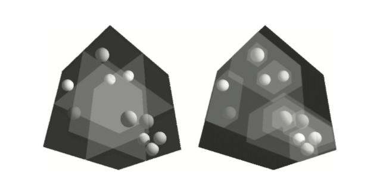

<center>图12.22。 左：空间的均匀划分。 右：自适应边界框层次结构。 图片由David DeMarle提供。</center>
### 12.3.1 边界框

在大多数相交加速方案中，关键操作是计算带有边界框的射线的交点（图12.23）。 这与常规的相交测试不同，因为我们不需要知道射线在盒子上的位置。 我们只需要知道它是否能达到目标即可。
为了建立光线盒相交的算法，我们首先考虑方向向量具有正x和y分量的2D光线。 稍后我们可以将其推广到任意3D射线。 2D边界框由两条水平线和两条垂直线定义：
$$
x = x_{min}, \\
x = x_{max}, \\
y = y_{min}, \\
y = y_{max}.
$$

这些线所包围的点可以用间隔符号来描述：
$$
(x, y) ∈ [x_{min}, x_{max}] × [y_{min}, y_{max}].
$$
如图12.24所示，相交测试可以用这些间隔来表述。 首先，我们计算射线击中线x = xmin时的ray参数：
$$
t_{xmin}=\frac{x_{min}-x_e}{x_d}.
$$
然后，我们对txmax，tymin和tymax进行类似的计算。 当且仅当间隔[txmin，txmax]和[tymin，tymax]重叠（即它们的交点是非空的）时，射线才击中盒子。 在伪代码中，该算法为：

```
txmin = (xmin − xe)/xd
txmax = (xmax − xe)/xd
tymin = (ymin − ye)/yd
tymax = (ymax − ye)/yd
if (txmin > tymax) or (tymin > txmax) then
	return false else
return true
```

if语句似乎不太明显。 要查看其逻辑，请注意，如果第一个间隔完全在第二个间隔的右侧或完全在第二个间隔的左侧，则没有重叠。

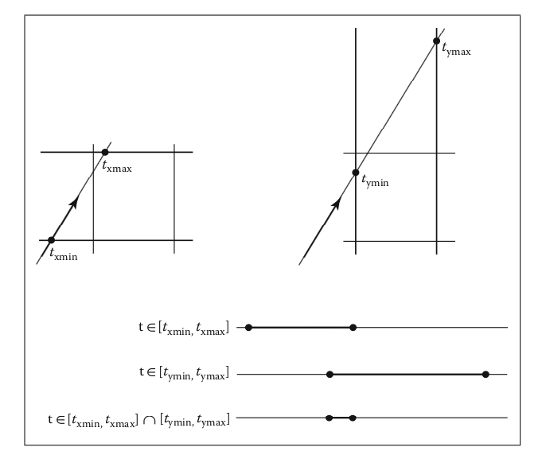

<center>图12.24。 射线将在其参数空间t∈[txmin，txmax]中处于x∈[xmin，xmax]间隔内。 y间隔也存在类似的间隔。 如果射线同时位于x间隔和y间隔中，则该射线与该框相交，即两个一维间隔的交点不为空。</center>
我们必须解决的第一件事是xd或yd为负数的情况。 如果xd为负，则射线将在到达xmin之前到达xmax。 因此，用于计算xmin和xmax的代码扩展为：

```
if (xd ≥ 0) then
	txmin = (xmin − xe)/xd 
	txmax = (xmax − xe)/xd
else
	txmin = (xmax − xe)/xd 
	txmax = (xmin − xe)/xd

```

对于y情况，必须进行类似的代码扩展。 一个主要问题是水平射线和垂直射线的yd和xd分别为零。 这将导致被零除，这可能是一个问题。 但是，在直接解决此问题之前，我们检查IEEE浮点计算是否为我们很好地处理了这些情况。 回顾第1.5节中的除零规则：对于任何正实数a，
$$
+a/0 = +∞; \\−a/0 = −∞.
$$
考虑xd = 0且yd> 0的垂直射线的情况。然后，我们可以计算
$$
t_{xmin}=\frac{x_{min}-x_e}{0}
\\
t_{xmax}=\frac{x_{max}-x_e}{0}
$$
有三种有趣的可能性：

1. xe≤xmin（无击中）；
2. xmin <xe <xmax（hit）;
3. xmax≤xe（无命中）。

对于第一种情况，我们有
$$
t_{xmin}=\frac{positive \quad number}{0};\\
t_{xmax}=\frac{positive \quad number}{0}.
$$
得出区间（txmin，txmin）=（∞，∞）。 该时间间隔不会与任何时间间隔重叠，因此不会出现任何命中情况。 对于第二种情况，我们有
$$
t_{xmin}=\frac{negative \quad number}{0};\\
t_{xmax}=\frac{negative \quad number}{0}.
$$
这将产生间隔（txmin，txmin）=（-∞，∞），该间隔将与所有间隔重叠，从而产生所需的匹配。 第三种情况导致间隔（-∞，-∞），根据需要不产生命中。 由于这些情况可以按需工作，因此我们不需要对其进行特殊检查。 通常，IEEE浮点约定是我们的盟友。 但是，这种方法仍然存在问题。

考虑一下代码段：

```
if (xd ≥ 0) then
	tmin = (xmin − xe)/xd 
	tmax = (xmax − xe)/xd
else
	tmin = (xmax − xe)/xd tmax = (xmin − xe)/xd
```

当xd = −0时，此代码将崩溃。 这可以通过测试xd的倒数来克服（A. Williams，Barrus，Morley和Shirley，2005年）：

```
a = 1/xd
if (a ≥ 0) then
	tmin = a(xmin − xe)
	tmax = a(xmax − xe) 
else
	tmin = a(xmax − xe) 
	tmax = a(xmin − xe)
```

### 12.3.2 分层边界框

分层边界框的基本思想可以通过在所有对象周围放置轴对齐的3D边界框的常见策略来看出，如图12.25所示。 实际上，命中边界框的光线比进行暴力搜索要昂贵得多，因为测试与边界框的相交不是免费的。 但是，错过盒子的光线比蛮力搜索便宜。 可以通过在一个框内划分对象集并在每个分区周围放置一个框来使这种边界框成为分层的，如图12.26所示。 图12.27中所示的层次结构的数据结构可能是一棵树，在树的根部有一个大的边界框，而在左右两个子树中有两个较小的边界框。 这些将依次指向三个三角形的列表。 光线与此特定的硬编码树的交集为：

```
if (ray hits root box) then
	if (ray hits left subtree box) then
		check three triangles for intersection 
	if (ray intersects right subtree box) then
		check other three triangles for intersection
	if (an intersections returned from each subtree) then
		return the closest of the two hits
	else if (a intersection is returned from exactly one subtree)then
		return that intersection 
	else
		return false 
else
	return false
```

与该算法有关的一些观察结果是，两个子树之间没有几何顺序，也没有理由射线不会同时击中两个子树。确实，没有理由两个子树可能不会重叠。
此类数据层次结构的一个关键点是，保证框可以绑定层次结构中位于其下方的所有对象，但不能保证它们包含在空间上与其重叠的所有对象，如图12.27所示。这使得这种几何搜索比对严格排序的一维数据的传统二进制搜索要复杂得多。读者可能会注意到，存在几种可能的优化方法。我们将优化推迟到拥有完整的分层算法为止。
如果我们将树限制为二进制，并要求树中的每个节点都有一个边界框，那么此遍历代码自然会扩展。此外，假设所有节点都是树中的叶子并且包含一个图元，或者它们包含一个或两个子树。
bvh-node类应为Surface类型，因此应实现surface :: hit。它包含的数据应该很简单：

```
class bvh-node subclass of surface
	virtual bool hit(ray e + td, real t0, real t1, hit-record rec) 
	virtual box bounding-box()
	surface-pointer left
	surface-pointer right
	box bbox
```

然后可以以面向对象的方式递归调用遍历代码：

```
function bool bvh-node::hit(ray a + tb, real t0, real t1, hit-record rec)
	if (bbox.hitbox(a + tb, t0, t1)) then
		hit-record lrec, rrec
		left-hit = (left ̸= NULL) and (left → hit(a + tb, t0, t1, lrec)) 
		right-hit = (right ̸= NULL) and (right → hit(a+tb, t0, t1, rrec)) 
		if (left-hit and right-hit) then
			if (lrec.t < rrec.t) then 
				rec = lrec
			else
				rec = rrec 
			return true
		else if (left-hit) then
    	rec = lrec	
			return true
		else if (right-hit) then
			rec = rrec
			return true 
		else
			return false 
	else
		return false
```

请注意，由于左和右指向表面而不是bvh节点，因此，我们可以让虚函数负责区分内部节点和叶节点。 适当的命中函数将被调用。 请注意，如果树的构建正确，我们可以消除对left是否为NULL的检查。 如果我们想消除对右是否为NULL的检查，则可以使用向左的冗余指针替换NULL右指针。 这样最终将向左两次检查，但是将消除整个树中的检查。 是否值得取决于树的构造细节。
有许多方法可以为边界体积层次构建树。 使树成为二叉树，大致平衡并且使同级子树的框不重叠太多是很方便的。 实现此目的的一种启发式方法是在将曲面划分为两个子列表之前，先沿轴对曲面进行排序。 如果轴由x = 0，y = 1和z = 2的整数定义，则我们有：

```
function bvh-node::create(object-array A, int AXIS) 
	N = A.length
	if (N= 1) then
		left = A[0]
		right = NULL
		bbox = bounding-box(A[0])
	else if (N= 2) then
		left-node = A[0]
		right-node = A[1]
		bbox = combine(bounding-box(A[0]), bounding-box(A[1]))
	else
		sort A by the object center along AXIS
		left= new bvh-node(A[0..N/2 − 1], (AXIS +1) mod 3) 
		right = new bvh-node(A[N/2..N−1], (AXIS +1) mod 3) 
		bbox = combine(left → bbox, right → bbox)
```

每次仔细选择AXIS可以提高树的质量。 一种方法是选择轴，以使两个子树的边界框的体积之和最小。 与通过轴旋转相比，此更改对于由同位素分布的小物体组成的场景几乎没有什么影响，但在行为欠佳的场景中可能会有很大帮助。 通过仅执行分区而不是完全排序，也可以使此代码更高效。
另一种可能更好的构建树的方法是让子树包含大约相同数量的空间，而不是相同数量的对象。 为此，我们根据空间对列表进行分区：

```
function bvh-node::create(object-array A, int AXIS)
	N = A.length
	if (N = 1) then
		left = A[0]
		right = NULL
		bbox = bounding-box(A[0])
	else if (N = 2) then
		left = A[0]
		right = A[1]
		bbox = combine(bounding-box(A[0]), bounding-box(A[1]))
	else
		find the midpoint m of the bounding box of A along AXIS 				partition A into lists with lengths k and (N − k) surrounding m 
		left = new bvh-node(A[0..k], (AXIS +1) mod 3)
		right = new bvh-node(A[k + 1..N − 1], (AXIS +1) mod 3) 
		bbox = combine(left → bbox, right → bbox)
```

尽管这会导致树不平衡，但它允许轻松遍历空白空间，并且由于分区比排序便宜，因此构建起来更便宜。

### 12.3.3 统一空间细分

减少相交测试的另一种策略是划分空间。 这与使用分层边界体积完成的对象划分在根本上不同：
•分层边界卷，每个对象都属于两个兄弟节点，而空间中的某个点可能位于两个兄弟节点内。
•在空间细分中，空间中的每个点都完全属于一个节点，而对象可能属于多个节点。
在统一的空间细分中，场景被划分为与轴对齐的框。 这些盒子的大小都是一样的，尽管它们不一定是立方体。 射线穿过这些框，如图12.28所示。 当一个对象被击中时，遍历结束。

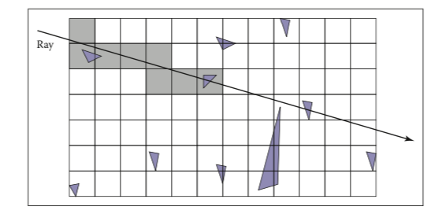

<center>图12.28。 在均匀的空间细分中，光线通过单元向前跟踪，直到击中其中一个单元中的物体。 在此示例中，仅检查阴影单元格中的对象。</center>

网格本身应该是表面的子类，并应实现为指向表面的3D指针数组。 对于空单元格，这些指针为NULL。 对于具有一个对象的单元格，指针指向该对象。 对于具有多个对象的单元格，指针可以指向列表，另一网格或另一数据结构，例如边界体积层次结构。
遍历以增量方式完成。 规律性来自于光线撞击每组平行平面的方式，如图12.29所示。 要查看这种遍历如何工作，请首先考虑2D情况，其中射线方向具有正的x和y分量，并在网格外部开始。 假设网格由（xmin，ymin）和（xmax，ymax）点界定。 网格具有nx×ny个单元。

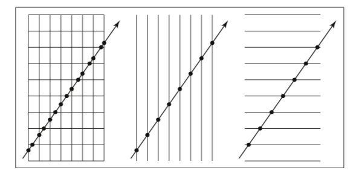

<center>图12.29。 尽管单元格命中的模式似乎不规则（左），但平行平面集合上的命中非常均匀。</center>

我们的首要任务是找到射线e + td命中的第一个像元的索引（i，j）。 然后，我们需要以适当的顺序遍历单元格。 该算法的关键部分是找到初始像元（i，j）并确定是递增i还是j（图12.30）。 请注意，当我们检查与单元格中的对象的交集时，我们将t的范围限制在单元格之内（图12.31）。 大多数实现使3D数组的类型为“指向表面的指针”。 为了改善遍历的局部性，可以像12.5节中讨论的那样对数组进行平铺。

### 12.3.4 轴对齐的二进制空间划分

我们还可以在分层数据结构中对空间进行分区，例如二进制空间分区树（BSP tree）。 这与12.4节中用于可见性排序的BSP树相似，但最常见的是使用轴对齐而不是多边形对齐的切割平面进行射线相交。
此结构中的节点包含单个切割平面以及左右子树。 每个子树在切割平面的一侧包含所有对象。 穿过平面的对象存储在两个子树中。 如果我们假设切割平面在x = D处平行于yz平面，则节点类为：

```
class bsp-node subclass of surface
	virtual bool hit(ray e + td, real t0, real t1, hit-record rec) 	 virtual box bounding-box()
	surface-pointer left
	surface-pointer right
	real D
```

我们稍后将其推广到y和z切割平面。 然后可以以面向对象的方式递归调用交集代码。 该代码考虑了图12.32中所示的四种情况。 为了我们的目的，这些射线的起点是参数t0的一点：
$$
\mathbf{p}=\mathbf{a}+t_0\mathbf{b}.
$$
这四种情况是：

1.射线仅与左子树交互，我们不需要测试它与切割平面的交点。 当xp <D和xb <0时发生。
2.将射线针对左侧子树进行测试，如果没有命中，则针对右侧子树进行测试。 我们需要在x = D处找到ray参数，因此可以确保仅测试子树内的交点。 这种情况出现在xp \< D and xb\> 0上。
为了确定我们向右还是向上前进，我们要跟踪与下一个垂直和水平边界的交点
的细胞。
3.这种情况类似于情况1，并且发生在xp> D和xb> 0的情况下。
4.这种情况类似于情况2，并且发生在xp> D和xb <0时。

依次处理这些情况的结果遍历代码为：

```
function bool bsp-node::hit(ray a + tb, real t0, real t1, hit-record rec)
	xp = xa + t0xb 
	if (xp < D) then
		if (xb < 0) then
			return (left ̸= NULL) and (left→hit(a + tb, t0, t1, rec))
		t = (D − xa)/xb 
		if (t > t1) then
			return (left ̸= NULL) and (left→hit(a + tb, t0, t1, rec)) 
		if (left ̸= NULL) and (left→hit(a + tb, t0, t, rec)) then
			return true
		return (right ̸= NULL) and (right→hit(a + tb, t, t1, rec))
	else
		analogous code for cases 3 and 4
```

这是非常干净的代码。 但是，要开始使用它，我们需要命中一些包含边界框的根对象，以便初始化遍历t0和t1。 我们必须解决的问题是切割平面可以沿任何轴。 我们可以向bsp-node类添加整数索引轴。 如果我们允许索引操作符用于点，这将导致对上面的代码进行一些简单的修改，例如，

$$x_p=x_a+t_0x_b$$

会成为

$$u_p=a[axis]+t_0b[axis]$$

这将导致一些其他的数组索引编制，但不会生成更多分支。
虽然单个bsp节点的处理比处理bvh节点的处理要快，但单个表面可能存在于多个子树中这一事实意味着存在更多节点，并且可能会占用更多内存。 树木的“好”程度决定了哪个更快。 构建树类似于构建BVH树。 我们可以选择要在一个周期中拆分的轴，也可以每次拆分一半，或者可以尝试更精细地划分。

## 12.4 BSP树的可见性

可以使用空间数据结构的另一个几何问题是确定视点变化的场景中对象的可见性顺序。
如果我们要制作由平面多边形组成的固定场景的许多图像，那么从不同的角度（例如游戏等应用程序通常是这样），我们可以使用与前面讨论的射线相交方法密切相关的二进制空间划分方案。 部分。 区别在于，为了进行可见性排序，我们使用了非轴对齐的分割平面，以便可以使这些平面与多边形重合。 这导致了一种优雅的算法，称为BSP树算法，可以从前到后对曲面进行排序。 BSP树的关键方面是它使用预处理来创建对任何视点都有用的数据结构。 因此，随着视点的变化，将使用相同的数据结构而不会发生变化。

### 12.4.1 BSP树算法概述

BSP树算法是画家算法的一个示例。 画家的算法从头到尾绘制每个对象，每个新的多边形都可能覆盖先前的多边形，如图12.33所示。 它可以按以下方式实现：

```
sort objects back to front relative to viewpoint 
for each object do
	draw object on screen
```

第一步（排序）的问题在于，即使每对对象的顺序都正确，多个对象的相对顺序也不总是很好地定义。这个问题在图12.34中说明，其中三个三角形形成一个循环。
BSP树算法适用于任何由多边形组成的场景，其中没有多边形与其他多边形定义的平面相交。然后通过预处理步骤放宽此限制。对于本讨论的其余部分，假定三角形是唯一的图元，但其思想扩展到任意多边形。
BSP树的基本思想可以用两个三角形T1和T2来说明。我们首先回想一下（见第2.5.3节）包含T1的平面的隐式平面方程：f1（p）=0。我们希望利用的隐式平面的关键特性是对于p一侧的所有点p +平面，f1（p +）> 0;对于平面另一侧的所有点p−，f1（p−）<0。使用此属性，我们可以找出平面T2的哪一侧。再次，这假定T2的所有三个顶点都在平面的同一侧。为了讨论起见，假设T2在平面的f1（p）<0侧。然后，对于任何视点e，我们都可以按正确的顺序绘制T1和T2：

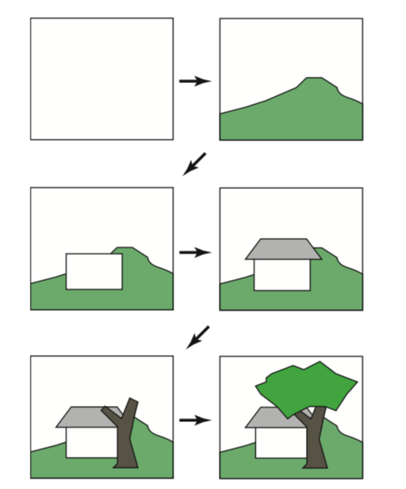

<center>图12.33。 画家的算法从空白图像开始，然后从头到尾一次绘制一个对象的场景，覆盖已经存在的所有对象。 这将自动消除隐藏的表面。</center>

```
if (f1(e) < 0) then 
	draw T1
	draw T2 
else
	draw T2
	draw T1
```

起作用的原因是，如果T2和e在包含T1的平面的同一侧，则从e观察，T2不可能完全或部分地被T1阻挡，因此先绘制T1是安全的 。 如果e和T2在包含T1的平面的相对两侧，则T2无法完全或部分阻挡T1，相反的绘制顺序是安全的（图12.35）。
如果没有一个对象跨越T1定义的平面，则该观察结果可以推广到许多对象。 如果我们使用以T1为根的二叉树数据结构，则树的负分支包含所有顶点的fi（p）<0的三角形，树的正分支包含所有顶点具有fi（p）的三角形 ）>0。我们可以按如下顺序绘制：

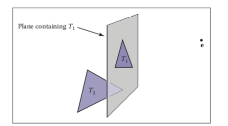

<center>图12.35。 当e和T2位于包含T1的平面的相对侧时，可以安全地先绘制T2，然后绘制T1。 如果e和T2在平面的同一侧，则应在T2之前绘制T1。 这是BSP树算法的核心思想。</center>

```
function draw(bsptree tree, point e) 
	if (tree.empty) then
		return
	if (ftree.root(e) < 0) then
		draw(tree.plus, e) 
		rasterize tree.triangle 
		draw(tree.minus, e)
	else
		draw(tree.minus, e) 
		rasterize tree.triangle 
		draw(tree.plus, e)
```

该代码的好处是它可以在任何视点e上工作，因此可以预先计算树。 注意，如果每个子树本身就是一棵树，根三角形将其他三角形相对于包含它的平面分成两组，则代码将按原样工作。 通过将递归调用终止一级，可以使效率稍高一些，但是代码仍然很简单。 图12.36中显示了说明此代码的树。 如第2.5.5节所述，包含三个非共线点a，b和c的平面上点p的隐式方程为


<center>图12.36。 三个三角形和一个对其有效的BSP树。 “正”和“负”分别由右和左子树位置编码。</center>

$$
f(\mathbf{p})=
((\mathbf{b}-\mathbf{a})\times(\mathbf{c}-\mathbf{a}))\cdot
(\mathbf{p}-\mathbf{a})=0.
\qquad\qquad(12.1)
$$

存储以下形式的隐式方程的（A，B，C，D）可能会更快
$$
f(x,y,z)=A_x+B_y+C_z+D=0
\qquad\qquad(12.2)
$$
等式（12.1）和（12.2）是等价的，当您回想起隐式方程的梯度是三角形的法线时，这很明显。 公式（12.2）的梯度为n =（A，B，C），仅是法向矢量
$$
\mathbf{n}=(\mathbf{b}-\mathbf{a})\times(\mathbf{c}-\mathbf{a}).
$$
我们可以通过插入平面上的任意点来求解D，例如：
$$
\begin{align}
D&=-Ax_{a}-By_a-Cz_a\\
&=-\mathbf{n}\cdot\mathbf{a}.
\end{align}
$$
这表明形式：
$$
\begin{align}
f(\mathbf{p})&=\mathbf{n}\cdot\mathbf{p}-\mathbf{n}\cdot\mathbf{a}\\
&=\mathbf{n}\cdot(\mathbf{p}-\mathbf{a})\\
&=0,
\end{align}
$$
一旦您记得使用叉积计算n，则该公式与公式（12.1）相同。 您使用哪种形式的平面方程式以及是否仅存储顶点，n和顶点，或仅存储n，D和顶点，这可能是一个问题，这是经典的时间存储权衡，可以通过分析来最好地解决 。 对于调试，最好使用公式（12.1）。
阻止上面的代码总体上起作用的唯一问题是，不能保证三角形可以在平面的一侧或另一侧进行唯一分类。 它可以在平面的一侧具有两个顶点，而在另一侧则具有第三个顶点。 或者它可以在平面上具有顶点。 这可以通过使用平面“切割”三角形将其分成较小的三角形来解决。

### 12.4.2 建造树

如果数据集中的三角形均不彼此交叉，则所有三角形都位于所有其他三角形的一侧，则可以使用以下算法构建可以使用上述代码遍历的BSP树：

```
	tree-root = node(T1) 
	for i ∈ {2,...,N} do
		tree-root.add(Ti) 
function add ( triangle T )
	if (f(a) < 0 and f(b) < 0 and f(c) < 0) then 
		if (negative subtree is empty) then
			negative-subtree = node(T ) 
		else
			negative-subtree.add (T )
	else if (f(a) > 0 and f(b) > 0 and f(c) > 0) then
		if positive subtree is empty then
    	positive-subtree = node(T )
		else
			positive-subtree.add (T ) 
	else
		we have assumed this case is impossible
```

我们唯一需要修复的是三角形与分割平面交叉的情况，如图12.37所示。 为简单起见，假设三角形在平面的一侧具有顶点a和b，而顶点c在另一侧。 在这种情况下，我们可以找到交点A和B，并将三角形切成三个具有顶点的新三角形
$$
T_1 =(a,b,A), \\
T_2 =(b,B,A), \\
T_3 =(A,B,c),
$$
如图12.38所示。 顶点的顺序很重要，因此法线的方向与原始三角形的方向相同。 如果我们假设f（c）<0，则下面的代码可以将这三个三角形添加到树中，假设正子树和负子树都不为空：

```
	positive-subtree = node (T1) 
	positive-subtree = node (T2) 
	negative-subtree = node (T3)
```

当顶点非常靠近拆分平面时，会出现困扰天真的实现的精度问题。 例如，如果我们在分裂平面的一侧有两个顶点，而另一顶点在另一侧只有极小的距离，我们将创建一个与旧三角形几乎相同的新三角形，即一个三角形 和一个几乎为零的三角形。 最好将其检测为特例，而不要拆分成三个新的三角形。 有人可能会认为这种情况很少见，但是由于许多模型具有细分的平面和带有共享顶点的三角形，因此这种情况经常发生，因此必须谨慎处理。 一些实现此目的的简单操作是：

```
function add( triangle T ) 
	fa = f(a)
	fb = f(b)
	fc = f(c)
	if (abs(fa) < ε) then
		fa = 0
	if (abs(f b) < ε) then 
		fb = 0
	if (abs(f c) < ε) then 
		fc = 0
	if (fa ≤ 0 and fb ≤ 0 and fc ≤ 0) then 
		if (negative subtree is empty) then
			negative-subtree = node(T )
		else
			negative-subtree.add(T )
	else if (fa ≥ 0 and fb ≥ 0 and fc ≥ 0) then
		if (positive subtree is empty) then 
			positive-subtree = node(T )
		else
			positive-subtree.add(T ) 
	else
		cut triangle into three triangles and add to each side

```

这将获取f值在平面ε内的所有顶点，并将其视为正数或负数。 常数ε是用户选择的小的正实数。 上面的技术是一种罕见的情况，其中测试浮点相等性是有用的，并且可以工作，因为设置了零值而不是对其进行计算。 与计算的浮点值进行相等性比较几乎是不可取的，但是我们没有这样做。

### 12.4.3 切割三角形

填写最后一种情况的细节“将三角形切成三个三角形并添加到每一侧”很简单，但很乏味。 我们应该利用BSP树的构造作为预处理，而效率不是关键。 相反，我们应该尝试编写干净的紧凑代码。 一个不错的技巧是，通过确保c在平面的一侧而其他两个顶点在另一侧，将许多情况强制为一种。 通过交换很容易做到这一点。 在最终的else语句中填充详细信息（假设为简单起见，子树为非空）将得出：

```
if (f a ∗ f c ≥ 0) then 
	swap(f b, f c) 
	swap(b, c)
	swap(f a, f b) 
	swap(a, b)
else if (fb ∗ fc ≥ 0) then 
	swap(f a, f c)
	swap(a, c)
	swap(f a, f b)
	swap(a, b)
	compute A 
	compute B
	T1 =(a,b,A) 
	T2 =(b,B,A)
	T3 =(A,B,c) 
	if (fc ≥ 0) then
		negative-subtree.add(T1) 
		negative-subtree.add(T2)
    positive-subtree.add(T3)
	else
		positive-subtree.add(T1) 
		positive-subtree.add(T2) 
		negative-subtree.add(T3)

```

该代码利用以下事实：a和b的乘积如果它们具有相同的符号，则为正，因此是第一个if语句。 如果顶点被交换，我们必须进行两次交换以保持顶点逆时针排列。 请注意，其中一个顶点可能恰好位于平面上，在这种情况下，上面的代码将起作用，但是生成的三角形之一的面积为零。 这可以通过忽略可能性来解决，这种可能性不是那么危险，因为光栅化代码必须处理屏幕空间中的零面积三角形（即边上三角形）。 您还可以添加不向树添加零面积三角形的检查。 最后，当f a，f b和f c之一恰好为零时，可以将一个三角形切成两个三角形，这是一种特殊情况。
要计算A和B，需要线段和隐式平面相交。 例如，连接a和c的参数线为
$$
\mathbf{p}(t)=\mathbf{a}+t(\mathbf{c}-\mathbf{a}).
$$
通过将p（t）插入平面方程，可以找到与平面n·p + D = 0的交点：
$$
\mathbf{n}·(\mathbf{a}+t(\mathbf{c}−\mathbf{a}))+D = 0,
$$
并求解t：
$$
t=-\frac{\mathbf{n}\cdot\mathbf{a}+D}{\mathbf{n}\cdot(\mathbf{c}-\mathbf{a})}.
$$
调用此解决方案tA，我们可以为A编写表达式：
$$
\mathbf{A}=a+t_A(\mathbf{c}-\mathbf{a})
$$
类似的计算将得出B。

### 12.4.4 优化树

与树遍历相比，树创建的效率要少得多，因为它是一个预处理过程。 BSP树的遍历花费的时间与树中节点的数量成正比。 （树的平衡程度无关紧要。）每个三角形都会有一个节点，包括因分割而创建的三角形。此数字可以取决于将三角形添加到树的顺序。例如，在图12.39中，如果T1是根，则树中将有两个节点，但是如果T2是根，则将有更多节点，因为T1将被拆分。
很难找到要添加到树中的三角形的“最佳”顺序。对于N个三角形，有N个！可能的订购。因此，尝试所有订购通常不可行。可替代地，可以从排列的随机集合中尝试一些预定数量的排序，并且可以为最终树保留最佳排序。
上述分割算法将一个三角形分割为三个三角形。将三角形分成三角形和凸四边形可能会更有效。如果所有输入模型都只有三角形，这可能不值得，但是很容易支持容纳任意多边形的实现。

## 12.5 拼接多维数组

有效地利用内存层次结构是设计现代架构算法的关键任务。 通过平铺（有时也称为砌块）可以确保多维数组以“精巧”的方式排列数据。 传统的2D数组与索引机制一起存储为1D数组。 例如，将Nx by Ny数组存储在长度为NxNy的1D数组中，并将2D索引（x，y）（从（0，0）到（Nx-1，Ny-1））映射到1D 索引（从0到NxNy − 1），使用公式
$$
index = x + N_xy.
$$
图12.40显示了该内存布局的示例。这种布局的问题在于，尽管同一行中的两个相邻数组元素在内存中彼此相邻，但同一列中的两个相邻元素将被内存中的Nx个元素分隔。对于较大的Nx，这可能导致较差的存储空间。对此的标准解决方案是使用图块使行和列的内存位置更均等。图12.41显示了一个示例，其中使用了2×2的图块。下一节将讨论为这样的数组建立索引的详细信息。之后，将介绍一个更复杂的示例，其中在3D阵列上具有两个层次的平铺。
一个关键问题是制作瓷砖的尺寸。实际上，它们应与计算机上的内存单元大小相似。例如，如果我们在具有128字节高速缓存行的计算机上使用16位（2字节）数据值，则8×8瓦片将完全适合高速缓存行。但是，使用适合32个元素到缓存线的32位浮点数，5×5tilesareabittoosmalland6×6tilesarea位太大。由于还存在较粗大的存储单元（例如页面），因此使用具有类似逻辑的分层切片可能会很有用。

### 12.5.1 2D阵列的一级平铺

如果我们假设将一个Nx×Ny阵列分解为正方形n×n个图块（图12.42），则所需的图块数为
$$
B_x = N_x/n, \\B_y =N_y/n.
$$
在这里，我们假设n精确地除以Nx和Ny。 如果不正确，则应填充数组。 例如，如果Nx = 15且n = 4，则应将Nx更改为16。要计算出为此类数组建立索引的公式，我们首先找到图块索引（bx，by），该图给出了该行的行/列 磁贴（磁贴本身形成2D数组）：

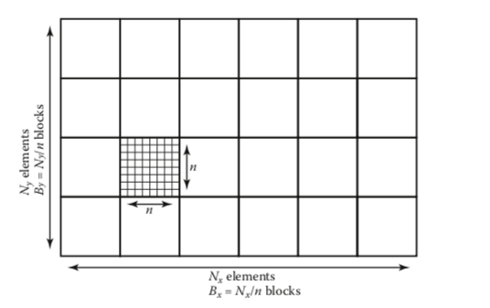

<center>图12.42。 由Bx×By组成的平铺2D数组，其大小分别为n x n。</center>

$$
b_x = x ÷ n,\\
b_y =y÷n,
$$

其中÷是整数除法，例如12÷5 =2。如果我们按图12.40所示按行对图块排序，则图块第一个元素的索引（bx，by）为
$$
index = n^2(B_xb_y + b_x).
$$
该图块中的存储器的排列方式类似于传统的2D阵列，如图12.41所示。 磁贴内部的局部偏移（x'，y'）为
$$
x′ =x\quad mod\quad n,\\
y′ =y\quad mod\quad n,
$$
其中mod是余数运算符，例如12 mod 5 =2。因此，图块内部的偏移为
$$
offset=y'n+x'.
$$
因此，在具有n×n个图块的Nx×Ny数组中查找一维索引元素（x，y）的完整公式为
$$
\begin{align}
index &= n^2(B_xb_y + b_x) + y′n + x′,\\
&= n^2((N_x ÷ n)(y ÷ n) + x ÷ n) + (y mod n)n + (x mod n).
\end{align}
$$
该表达式包含许多整数乘法，除法和模运算，在某些处理器上这是昂贵的。 当n为2的幂时，这些运算可以转换为移位和按位逻辑运算。 但是，如上所述，理想大小并不总是2的幂。 某些乘法可以转换为移位/加法运算，但除法和模数运算则存在更多问题。 可以递增地计算索引，但是这将需要跟踪计数器，并且具有大量的比较和较差的分支预测性能。
但是，有一个简单的解决方案。 请注意，索引表达式可以写成
$$
index = F_x(x) + F_y(y),
$$
其中
$$
\begin{align}
F_x（x）&= n^2（x÷n）+（x mod n），\\
F_y（y）&= n^2（N_x÷n）（y÷n）+（y mod n）n。
\end{align}
$$
我们将Fx和Fy制成表格，并使用x和y在数据数组中查找索引。 这些表将分别由Nx和Ny元素组成。 这些表的总大小将适合处理器的主数据缓存，即使对于非常大的数据集大小也是如此。

### 12.5.2 示例：3D阵列的二级平铺

有效的TLB利用率也已成为算法性能的关键因素。 通过创建m×m×n×n×n个单元，可以使用相同的技术来提高3D阵列中的TLB命中率。 例如，可以将40×20×19的体积分解为4×2×2宏块，即2×2×2块5×5×5单元的砖。 这对应于= 2且n = 5。 因为19不能被mn = 10分解，所以需要一层填充。 经验上有用的大小对于16位数据集为m = 5，对于浮点数据集为m = 6。
可以使用以下表达式对任何（x，y，z）三元组计算得出的数据数组索引
$$
\begin{align}
index =&
((x÷n)÷m)n3m3((Nz ÷n)÷m)((Ny ÷n)÷m) \\
&+((y÷n)÷m)n3m3((Nz ÷n)÷m)\\
&+((x ÷ n) mod m)n3m2\\
&+((y ÷ n) mod m)n3m \\
&+((z ÷ n) mod m)n3 \\
&+(x mod (n2))n2\\
&+(y mod n)n\\
&+(z mod n),
\end{align}
$$
其中Nx，Ny和Nz是数据集的各自大小。
请注意，就像在更简单的2D一级情况下一样，此表达式可以写成
$$
index = F_x(x) + F_y(y) + F_z(z),
$$
其中
$$
\begin{align}
F_x(x) =&((x÷n)÷m)n3m3((Nz ÷n)÷m)((Ny ÷n)÷m) \\
&+((x ÷ n) mod m)n3m2\\
&+(x mod n)n2,\\
F_y(y) =&((y÷n)÷m)n3m3((Nz ÷n)÷m) \\
&+((y ÷ n) mod m)n3m +\\
&+(y mod n)n,\\
Fz(z) =&((z ÷ n) ÷ m)n3m3 \\
&+((z ÷ n) mod m)n3 \\
&+(z mod n).

\end{align}
$$

## 常见问题

•平铺是否真的对性能有很大影响？

在某些体绘制应用程序上，两级平铺策略产生的性能差异高达十分之一。 当阵列不适合主内存时，它可以有效防止某些应用程序中的抖动，例如图像编辑。

•如何将列表存储在有翼的结构中？

对于大多数应用程序，将数组和索引用作引用是可行的。 但是，如果要执行许多删除操作，则使用链接列表和指针是明智的。

### 记录

关于有翼边的数据结构的讨论基于Ching-Kuang Shene的课程笔记（Shene，2003年）。 网格数据结构比翼状边缘小。 使用这种结构的权衡在“定向边-三角形网格的可伸缩表示形式”中进行了讨论（Campagna，Kobbelt和Seidel，1998年）。 平铺阵列的讨论基于用于体积可视化的交互式射线追踪（S. Parker等人，1999）。 Charles Loop（Loop，2000）在一份技术报告中讨论了类似于三角形邻居结构的结构。 歧管的讨论可以在介绍性拓扑文本中找到（Munkres，2000年）。

### 练习题

1.对于一个简单的四面体，将其存储为四个独立的三角形，将一个四面体存储在有翼边的数据结构中，其存储差异是什么？
2.绘制自行车的场景图。

3.一个n维数组的单层切片需要多少个查找表？
4.给定N个三角形，可以添加到生成的BSP树的最小三角形数量是多少？ 最大数量是多少？