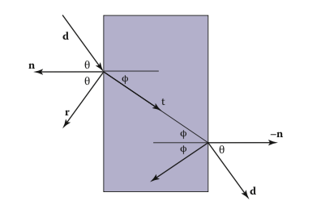
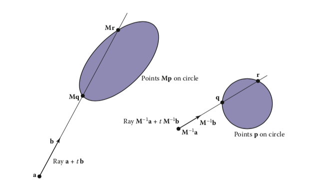
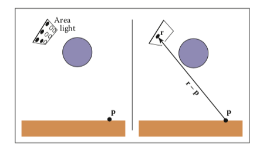
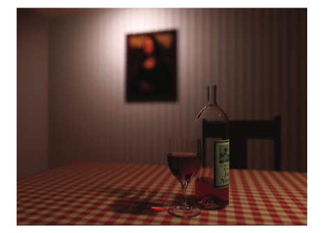

# 更深层的光线追踪

光线追踪器是在其上构建各种高级渲染效果的绝佳基材。许多需要花大量时间才能适应对象顺序光栅化框架的效果，包括第4章中已介绍的阴影和反射等基础知识，在光线跟踪器中既简单又优雅。在本章中，我们将讨论一些更高级的技术，这些技术可用于光线跟踪更广泛的场景并包含更广泛的效果。一些扩展允许使用更通用的几何：实例化和构造实体几何（CSG）是使模型更复杂且在程序中添加最小复杂度的两种方法。其他扩展功能增加了我们可以处理的材料范围：通过透明材料（例如玻璃和水）进行折射以及在各种表面上进行光泽反射对于许多场景中的真实感至关重要。
本章还讨论了分布射线跟踪的一般框架（Cook，Porter和Carpenter，1984年），它是对基本射线跟踪思想的有力扩展，在该模型中，多个随机射线通过图像中的每个像素发送至产生具有平滑边缘的图像，并简单优雅地（如果缓慢）产生从柔和阴影到相机景深的各种效果。
高雅的光线追踪价格取决于计算机时间：这些扩展中的大多数将为任何不平凡的场景追踪非常多的光线。因此，至关重要的是使用第12章中描述的方法来加速光线的跟踪。

## 13.1 透明度和折射

在第4章中，我们讨论了使用递归射线跟踪来计算表面的镜面反射或镜面反射。 另一种镜面物体是介电的，一种透明的材料可以折射光。 钻石，玻璃，水和空气是电介质。 电介质还可以滤光； 有些玻璃比绿色滤出更多的红色和蓝色光，因此玻璃呈现绿色。 当光线从折射率为n的介质传播到折射率为nt的介质时，某些光会透射并弯曲。 在图13.1中显示为nt> n。 斯涅尔定律告诉我们
$$
n\sin\theta = n_t \sin\phi.
$$
计算两个向量之间的夹角的正弦通常不如计算余弦那样方便，余弦是像我们这里这样的单位向量的简单点积。 使用三角恒等式sin2θ+ cos2θ= 1，我们可以得出余弦的折射关系：
$$
\cos^2\phi=1-\frac{n^2(1-\cos^2)}{n^2_t}.
$$
请注意，如果n和nt取反，则θ和φ也取反，如图13.1右侧所示。



<center>图13.1斯涅尔定律描述了角度φ如何取决于角度θ以及物体和周围介质的折射率。</center>

要将sinφ和cosφ转换为3D向量，我们可以在表面法线n和射线方向d的平面中建立2D正交法线基础。
从图13.2，我们可以看到n和b构成了折射平面的正交基础。 根据定义，我们可以在此基础上描述变换射线t的方向：
$$
\mathbf{t}=\sin\phi\mathbf{b}-\cos\phi\mathbf{n}.
$$
因为我们可以在相同的基础上描述d，并且d是已知的，所以我们可以求解b：
$$
\mathbf{d}=\sin\phi\mathbf{b}-cos\phi\mathbf{n},\\
\mathbf{b}=\frac{\mathbf{d}+\mathbf{n}\cos\phi}{\sin\phi}.
$$
这意味着我们可以用已知变量求解t：
$$
\begin{align}
\mathbf{t}&=\frac{n(\mathbf{d}+\mathbf{n}\cos\phi)}{n_t}-\mathbf{n}\cos\phi\\
&=\frac{n(\mathbf{d}+\mathbf{n}(\mathbf{d}\cdot\mathbf{n}))}{n_t}-\mathbf{n}\sqrt{1-\frac{n^2(1-(\mathbf{d}\cdot\mathbf{n})^2)}{n_t^2}}.
\end{align}
$$
请注意，无论n和nt中的哪个较大，此方程均有效。 一个直接的问题是：“如果平方根下的数字为负，该怎么办？” 在这种情况下，没有折射光线，并且所有能量都被反射。 这称为全内反射，它负责玻璃物体的丰富外观。
电介质的反射率根据菲涅耳方程随入射角而变化。 实现与菲涅尔方程近似的方法的一种好方法是使用Schlick近似（Schlick，1994a），
$$
R(θ)=R_0 +(1−R_0)(1−cosθ)^5,
$$
其中R0是法向入射时的反射率：
$$
R_0=(\frac{n_t-1}{n_t+1})^2.
$$
请注意，上面的cosθ项始终是指空气中的角度（相对于法线的内角和外角较大）。

对于典型的有色玻璃中发现的均匀杂质，根据比尔定律，载光的强度会衰减。 当射线穿过介质传播时，它会根据dI = -CI dx失去强度，其中dx是距离。 因此，dI / dx ＝ -CI。 我们可以求解该方程，并得到指数I = k exp（-Cx）。 衰减程度由RGB衰减常数a表示，该常数是一单位距离后的衰减量。 在边界条件下，我们知道I（0）= I0，而I（1）= aI（0）。 前者意味着I（x）= I0 exp（-C x）。 后者意味着Ia = I0 exp（-C），因此-C = ln（a）。 因此，最终公式为
$$
I(s) = I(0)e^{ln(a)s},
$$
其中，I（s）是距界面距离s处的光束强度。 在实践中，我们很少对它们进行逆向工程，因为这样的数据很难找到。 在图13.3中可以看到比尔定律的效果，其中的玻璃呈绿色。
为了向我们的代码中添加透明材料，我们需要一种方法来确定射线何时“进入”对象。 最简单的方法是假设所有物体都埋在折射率非常接近1.0的空气中，并且表面法线指向“向外”（朝向空气）。 具有这些假设的射线和电介质的代码段为：

```
if (p is on a dielectric) then 
	r = reflect(d, n )
	if (d · n < 0) then
		refract(d, n, n, t) 
		c = −d · n
		kr =kg =kb =1
	else
		kr = exp(−art)
		kg = exp(−agt)
		kb = exp(−abt)
		if refract(d, −n, 1/n, t) then
			c=t·n 
		else
			return k ∗ color(p + tr) 
	R0 = (n−1)2/(n+1)2
	R=R0 +(1−R0)(1−c)5
	return k(R color(p + tr) + (1 − R) color(p + tt))

```

上面的代码假定自然对数已被折叠为常数（ar，ag，ab）。 如果存在全内反射，则折射函数将返回false，否则将填充参数列表的最后一个参数。

## 13.2 实例化

光线跟踪的一个优雅特性是它允许非常自然的实例化。实例化的基本思想是在显示对象之前，通过变换矩阵使对象上的所有点变形。例如，如果我们分别以x和y的比例因子（2，1）变换单位圆（在2D中），然后将其旋转45°，然后在x方向上移动一个单位，则结果是椭圆形，其偏心率为2，并且沿（x = -y）方向的长轴以（0，1）为中心（图13.4）。使该实体成为“实例”的关键是我们存储了圆和复合变换矩阵。因此，椭圆的显式构造在渲染时保留为将来的操作。
实例化光线跟踪的优点是我们可以选择进行相交的空间。如果基础对象由一组点组成，其中一个是p，则转换后的对象由矩阵M转换的那组点组成，其中示例点被转换为Mp。如果我们有一条要与变换后的对象相交的射线a + tb，则可以将逆变换后的射线与未变换的对象相交（图13.5）。在未变换的空间中进行计算有两个潜在的优势（即，图13.5的右侧）：

1.未变换的对象可能具有更简单的相交例程，例如，球体与椭圆体。
2.许多变换后的对象可以共享同一未变换的对象，从而减少了存储量，例如汽车的交通拥堵，其中单个汽车只是几个基本模型（未变换）的变换。

如第6.2.2节所述，表面法线向量的变换方式不同。 考虑到这一点，并使用图13.5中所示的概念，我们可以确定射线与由矩阵M转换的对象的交点。如果我们创建类型为surface的实例类，则需要创建一个hit函数：

```
instance::hit(ray a + tb, real t0, real t1, hit-record rec)
ray r′ = M−1a + tM−1b
if (base-object→hit(r′, t0, t1, rec)) then 
	rec.n = (M−1)Trec.n
	return true
else
	return false
```



<center>图13.5。 两个空间中的射线相交问题只是彼此的简单变换。 该对象指定为球体加矩阵M。射线在变换的（世界）空间中通过位置a和方向b指定。</center>

关于此函数的一个巧合之处在于，无需更改参数rec.t，因为在两个空间中它都相同。 还要注意，我们不需要计算或存储矩阵M。
这就提出了一个非常重要的观点：射线方向b不得限制为单位长度矢量，或者以上任何基础结构都不能起作用。 因此，不要将射线方向限制为单位矢量是有用的。

## 13.3 构造实体几何

关于光线跟踪的一件好事是，可以将与3D线相交的任何几何图元无缝地添加到光线跟踪器中。事实证明，将构造实体几何（CSG）添加到光线跟踪器也很简单（Roth，1982）。 CSG的基本思想是使用设置操作来组合实体形状。这些基本操作如图13.6所示。这些操作可以视为设置操作。例如，我们可以考虑C为圆中所有点的集合，而S为方形中所有点的集合。相交运算C∩S是同时属于C和S的所有点的集合。其他运算类似。
尽管可以直接在模型上进行CSG，但是如果只需要一张图像，我们就无需显式更改模型。相反，当光线与模型交互时，我们直接在光线上执行设置操作。为了使之自然，我们找到了光线与模型的所有交点，而不仅仅是最接近的交点。例如，araya + tbmighthitasphereatt = 1andt =2。在CSG的上下文中，我们认为这是射线位于t∈[1，2]的球体内。我们可以计算所有表面的“内部间隔”，并在这些间隔上进行设置操作（请参见第2.1.2节）。这在图13.7中进行了说明，其中命中间隔被处理以指示差异对象内部有两个间隔。 t> 0的第一个碰撞是射线实际相交的地方。
实际上，CSG相交例程必须维护一个间隔列表。确定第一个命中点时，材料属性和表面法线就是与该命中点关联的属性。此外，您必须注意精度问题，因为没有什么可以阻止用户抓住两个相邻的物体并进行相交。通过消除厚度小于一定公差的任何间隔，可以使其变得坚固。

## 13.4 分布光线追踪

对于某些应用程序，光线跟踪图像太“干净”。 使用分布射线跟踪可以减轻这种影响（Cook等，1984）。 常规的光线追踪图像看起来很干净，因为一切都很清晰。 阴影完全清晰，反射没有模糊感，并且一切都聚焦完美。 有时，我们希望使阴影柔和（就像现实生活中的阴影一样），使反射像拉丝金属一样模糊，并且像在具有大光圈的照片中那样，图像具有可变的聚焦度。 虽然从第一原理中完成这些事情就有些涉及了（如第23章所述），但我们可以通过对基本光线跟踪算法进行一些相当简单的更改来获得大部分视觉效果。 另外，该框架为我们提供了一种相对简单的方式来对图像进行抗锯齿（请参见第8.3节）。

### 13.4.1 抗锯齿

回想一下，对图像进行抗锯齿的简单方法是计算像素区域的平均颜色，而不是中心点的颜色。 在光线跟踪中，我们的计算原语是计算屏幕上某个点的颜色。 如果我们将整个像素中的许多这些点取平均值，我们就是在逼近真实平均值。 如果包围像素的屏幕坐标为[i，i + 1]×[j，j + 1]，则可以替换循环：

```
for each pixel (i, j) do
	cij =ray-color(i+0.5,j+0.5)
```

使用在每个像素内的常规n×n采样网格上采样的代码：

```
for each pixel (i, j) do
	c=0
	for p = 0 to n − 1 do
		for q = 0 to n − 1 do
			c = c + ray-color(i + (p + 0.5)/n, j + (q + 0.5)/n)
	cij = c/n2

```

这通常称为常规采样。 n = 4的像素中的16个采样位置如图13.9所示。 请注意，这产生的答案与渲染传统的光线跟踪图像（通过nyn分辨率以nxn的分辨率每个像素一个样本，然后对n x n像素的块进行平均以获得nx ny图像）的答案相同。
以像素内的规则图案进行采样的一个潜在问题是可能会出现诸如波纹图案之类的规则伪影。 如图13.10所示，通过在每个像素内以随机模式采集样本，可以将这些伪像变成噪声。 这通常称为随机抽样，只涉及代码的少量更改：

```
for each pixel (i, j) do 
	c=0
	forp=1ton2 do
		c = c+ ray-color(i + ξ, j + ξ)
	cij = c/n2
```

ξ是一次调用，它返回范围为[0，1）的统一随机数。 不幸的是，除非进行大量采样，否则噪声可能会令人反感。 一种折衷方案是制定一种随机干扰常规网格的混合策略：

```
for each pixel (i, j) do 
	c=0
	for p = 0 to n − 1 do
		for q = 0 to n − 1 do
			c = c + ray-color(i + (p + ξ)/n, j + (q + ξ)/n)
	cij = c/n2
```

该方法通常称为抖动或分层采样（图13.11）。

### 13.4.2 软阴影

阴影在标准光线跟踪中难以处理的原因是，光线是无限的点或方向，因此可见或不可见。在现实生活中，灯光的面积非零，因此部分可见。这个想法在图13.12的2D中显示。光线完全不可见的区域称为本影。部分可见的区域称为半影。对于没有阴影的区域，没有一个常用的术语，但有时也称为反本影。
实施柔和阴影的关键在于以某种方式将光线视为一个区域而不是一个点。一种简单的方法是用一组分布的N个点光源对光进行逼近，每个点光源的基本光强度为N分之一。图13.13的左侧说明了此概念，其中使用了九个灯。您可以在标准的光线跟踪器中执行此操作，这是在现成的渲染器中获得柔和阴影的常见技巧。这种技术有两个潜在的问题。首先，通常需要数十个点光源来获得视觉上平滑的结果，这大大降低了程序的速度。第二个问题是阴影在半影内具有急剧的过渡。
分布射线跟踪在阴影代码中引入了很小的变化。与其将区域光表示为离散数量的点光源，不如将其表示为无限数量，并为每条观察射线随机选择一个。这相当于为被照亮的任何表面点在灯光上选择一个随机点，如图13.13右侧所示。
如果光线是由角点c和两个边缘向量a和b（图13.14）指定的平行四边形，那么选择随机点r很简单：
$$
r = c + ξ1a + ξ2b,
$$
其中ξ1和ξ2是在[0，1）范围内的均匀随机数。
然后，我们将阴影射线发送到这一点，如图13.13右侧所示。 请注意，此光线的方向不是单位长度，根据其假设，可能需要对基本光线跟踪器进行一些修改。
我们真的很想使点抖动。 但是，不加思索地执行此操作可能很危险。 我们不希望总是让像素左上角的光线生成到光线左上角的阴影光线。 相反，我们希望对样本进行加扰，以使像素样本和光样本本身都发生抖动，但是像素样本和光样本之间没有相关性。 实现此目的的一种好方法是生成两组不同的n2个抖动样本，并将样本传递到光源例程中：



<center>图13.13。 左：区域照明可以近似于一些点光源； 九个点中的四个对p可见，因此在半影中。 右：阴影光线选择了灯光上的随机点，它有一定的机会命中或不命中光线。</center>

```
for each pixel (i, j) do 
	c=0
	generate N =N^2 jittered 2D points and store in array r[]
	generate N =N^2 jittered 2D points and store in array s[]
	shuffle the points in array s[ ] 
	for p = 0 to N − 1 do
		c = c + ray-color(i + r[p].x(), j + r[p].y(), s[p]) 
	cij = c/N
```

该混洗例程消除了阵列r和s之间的任何相干性。 影子例程将仅使用存储在s [p]中的2D随机点，而不是调用随机数生成器。 索引从0到N − 1的数组的重排例程是：

```
for i = N − 1 downto 1 do
	choose random integer j between 0 and i inclusive 
	swap array elements i and j
```

### 13.4.3 景深

大多数照片中看到的柔焦效果可以通过以非零尺寸的“镜头”而不是某个点收集光来模拟。这称为景深。透镜从圆锥体的方向收集光，圆锥体的顶点位于所有物体都聚焦的距离处（图13.15）。我们可以将要采样的“窗口”放置在所有物体都聚焦的平面上（而不是像以前那样放置在z = n平面上），并且将晶状体放在眼睛上。到一切都处于聚焦状态的平面的距离称为聚焦平面，并且由用户设置到聚焦平面的距离，就像在真实相机中到聚焦平面的距离由用户或测距仪设置一样。
为了忠实于真实的相机，我们应该将镜头制作成光盘。但是，使用方形透镜我们会得到非常相似的效果（图13.16）。因此，我们选择镜头的侧面长度并对其随机取样。视线的起点将是这些扰动的位置，而不是眼睛的位置。再次，改组例程用于防止与像素样本位置的相关。图13.17显示了一个示例，该示例使用每个像素25个样本和一个大的圆盘透镜。



<center>图13.17。 景深的一个例子。 如第23章所述，使用粒子跟踪计算酒杯阴影中的苛性碱。</center>

### 13.4.4 光泽反射

一些表面（例如拉丝金属）在理想镜面和漫反射表面之间的某个位置。 在反射中可以看到一些可辨认的图像，但是模糊。 我们可以通过随机扰动理想的镜面反射光线来模拟这一点，如图13.18所示。
仅需要弄清楚两个细节：如何选择向量r'以及当所产生的扰动射线位于反射射线的表面以下时该怎么做。 当光线低于表面时，通常通过返回零色来解决后一个细节。

为了选择r'，我们再次对随机平方进行采样。 这个正方形与r垂直，并且宽度a控制模糊程度。 我们可以使用第2.4.6节中的技术通过创建w = r的正交基准来设置正方形的方向。 然后，我们在2D正方形中创建一个随机点，其边长a以原点为中心。 如果我们有2D个采样点（ξ，ξ'）∈[0,1] 2，则期望正方形上的相似点为
$$
u=-\frac{a}{2}+\xi a,\\
v=-\frac{a}{2}+\xi' a.
$$
因为我们将要扰动的平方与u和v向量都平行，所以射线r'只是
$$
\mathbf{r}′ =\mathbf{r}+u\mathbf{u}+v\mathbf{v}.
$$
请注意，r'不一定是单位矢量，并且如果您的代码要求对射线方向使用r'，则应将其标准化。

### 13.4.5 运动模糊

我们可以为对象添加模糊的外观，如图13.19所示。 这称为运动模糊，是在非零时间段内形成图像的结果。 在真实的相机中，光圈会在物体移动的某个时间间隔内打开。 我们可以通过设置从T0到T1的时间变量来模拟光圈。 对于每条视线，我们选择一个随机时间，
$$
T = T_0 + ξ(T_1 − T_0).
$$
我们可能还需要创建一些随时间移动的对象。 例如，我们可能有一个运动球体，其中心在间隔内从c0到c1。 给定T，我们可以计算实际中心并与该球体进行射线相交。 因为每条射线是在不同的时间发送的，所以每条射线将在不同的位置遇到球体，最终外观将变得模糊。 注意，移动球体的边界框应限制其整个路径，以便可以在整个时间间隔内建立效率结构（Glassner，1988）。

## 常见问题

•最佳的射线相交效率结构是什么？
最受欢迎的结构是二进制空间分区树（BSP树），统一细分网格和边界体积层次结构。 大多数使用BSP树的人都会使分裂平面与轴对齐，这种树通常称为k-d树。 没有一个明确的答案是最好的，但是实际上，所有答案都比蛮力搜索好得多。 如果我仅实现一个，则由于其简单性和鲁棒性，它将成为边界卷层次结构。
•人们为什么使用边界框而不是球形或椭圆形？
有时球体或椭圆体更好。 但是，许多模型的多边形元素被框紧紧地束缚，但是很难与椭圆形紧紧地束缚在一起。

###笔记

在光线跟踪框架中可以实现许多其他许多高级方法。 一些进一步的信息资源包括Glassner的“射线追踪简介和数字图像合成原理”，Shirley的逼真的射线追踪以及Pharr和Humphreys的基于物理的渲染：从理论到实现。