# 常用makedown写法

## 1.下划线

\underline{文字}

效果:$$\underline{文字}$$

## 2.斜体

\*{文字}\*

效果:*文字*

## 3.加粗

\textbf{文字}

\mathbf{文字}

效果:$$\textbf{文字}$$

## 4.设置字号与颜色

<font size =2 color=#11FFFF>{文字}<font>

效果:<font size =2 color=#11FFFF>文字111</font>

=#51537F

## 5.矩阵

1.带中挎号的矩阵
$$
\left[ 

\begin{matrix} 

a & b & c & d & e\\

f & g & h & i & j \\

 k & l & m & n & o \\ 

p & q & r & s & t 

\end{matrix} 

\right]
$$

```LaTeX
\left[ \begin{matrix} a & b & c & d & e\\ f & g & h & i & j \\ k & l & m & n & o \\ p & q & r & s & t \end{matrix} \right]
```

2.矩阵中间有省略号
$$
A= \left\{ \begin{matrix} a & b & \cdots & e\\ f & g & \cdots & j \\ \vdots & \vdots & \ddots & \vdots \\ p & q & \cdots & t \end{matrix} \right\}
$$

```LaTeX
A= \left\{ \begin{matrix} a & b & \cdots & e\\ f & g & \cdots & j \\ \vdots & \vdots & \ddots & \vdots \\ p & q & \cdots & t \end{matrix} \right\}
```

3.矩阵中间加根横线
$$
A= \left\{ \begin{array}{cccc|c} a & b & c & d & e\\ f & g & h & i & j \\ k & l & m & n & o \\ p & q & r & s & t \end{array} \right\}
$$

```swift
A= \left\{ \begin{array}{cccc|c} a & b & c & d & e\\ f & g & h & i & j \\ k & l & m & n & o \\ p & q & r & s & t \end{array} \right\}
```

## 6.LaTeX数学公式

１、指数和下标可以用^和_后加相应字符来实现。比如：

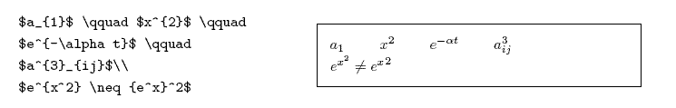

2、平方根（square root）的输入命令为：\sqrt，n 次方根相应地为: \sqrt[n]。方根符号的大小由LATEX自动加以调整。也可用\surd 仅给出符号。比如：

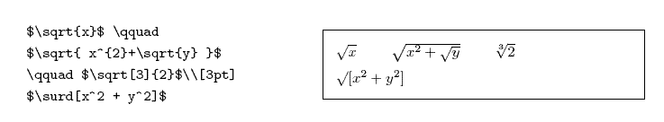

3、命令\overline 和\underline 在表达式的上、下方画出水平线。比如：

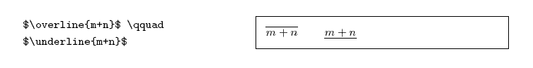

4、命令\overbrace 和\underbrace 在表达式的上、下方给出一水平的大括号。

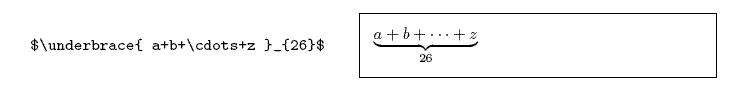

5、向量（Vectors）通常用上方有小箭头（arrow symbols）的变量表示。这可由\vec 得到。另两个命令\overrightarrow 和\overleftarrow在定义从A 到B 的向量时非常有用。

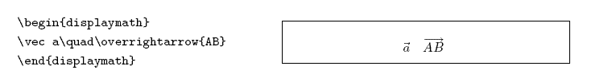

6、分数（fraction）使用\frac{...}{...} 排版。一般来说，1/2 这种形式更受欢迎，因为对于少量的分式，它看起来更好些。

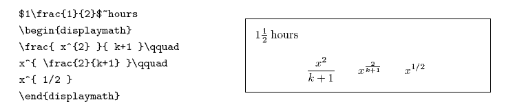

7、积分运算符（integral operator）用\int 来生成。求和运算符（sum operator）由\sum 生成。乘积运算符（product operator）由\prod 生成。上限和下限用^ 和_来生成，类似于上标和下标。

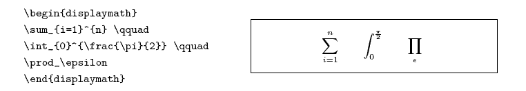

##以下提供一些常用符号的表示方法

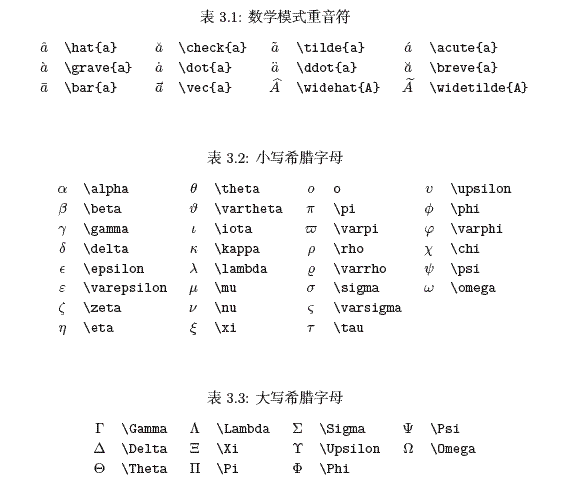

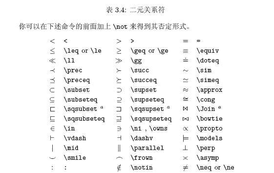

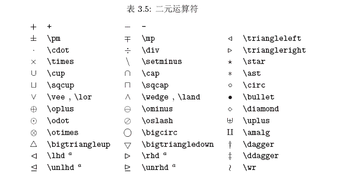

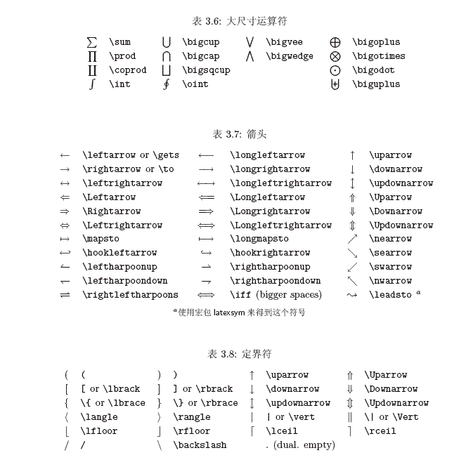

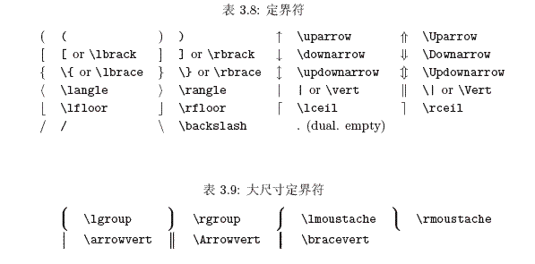

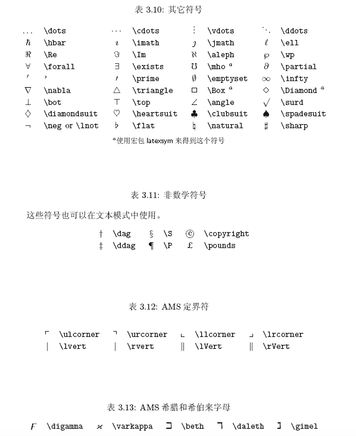

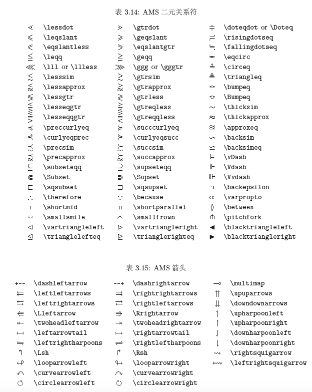


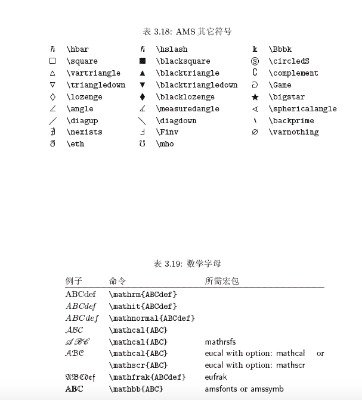


参考文献:

1.http://www.mohu.org/info/symbols/symbols.htm

2.https://www.jianshu.com/p/756bc7e0ef6d