# 1.向量性质

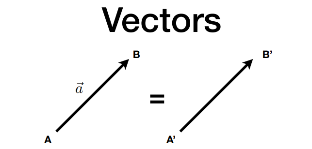

**定义**:具有方向的线段,没有绝对的起点.

可以写作行向量或者是列向量,(行列向量互为转置,但意义相同).

列向量: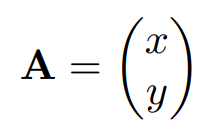

行向量: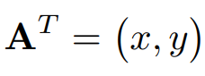

## 1.1向量的大小

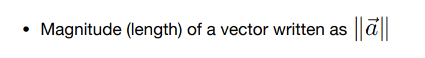

**向量的大小**:

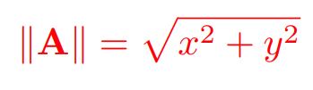

## 1.2向量正交化

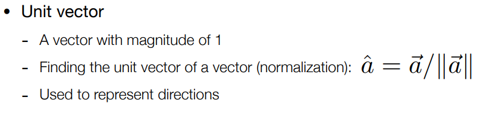

**大小为1的向量,仅代表方向**

由向量除以自身的模(大小)获得.

# 2.向量加法

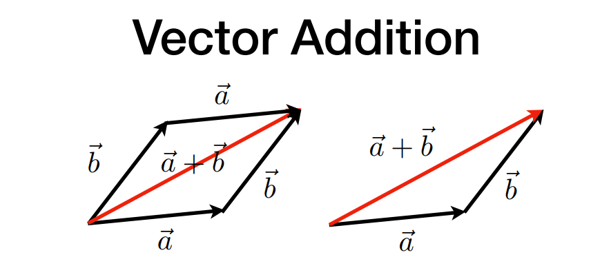

四边形法则:构建以向量a和b为边的平行四边形,连接平行四边形的对角线.

三角形法则:向量a+向量b=将a的尾部连接b的头部,最后连接向量a的头部和向量b的尾部.

# 3.向量乘法

## 3.1向量点乘

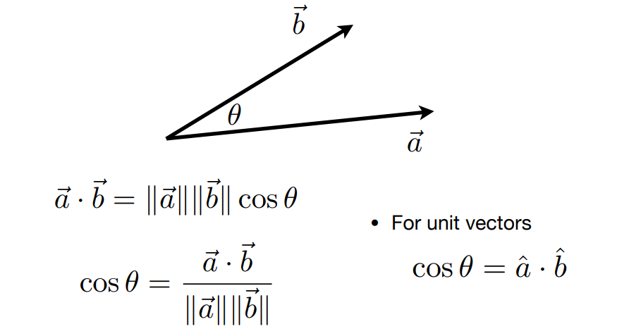

### **点乘满足的性质**:

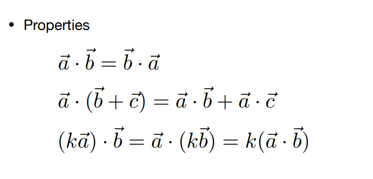

### **点乘的计算**:

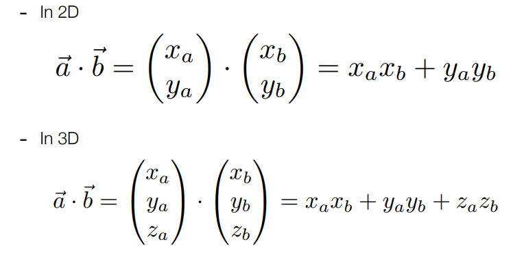

### **点乘的运用**:

1.确认两向量之间的夹角:**$$\cos\phi=\frac{a \cdot b}{||a||\cdot||b||}$$**

->确立两个向量之间是否同向或反向.

->确认两个向量之间的靠近程度,取值[-1,1],-1反向,1同向,0垂直.

2.确认一个向量在另一个向量上的投影:**$$|a|\cdot\cos\phi $$**

->分解向量,将向量分解为垂直和平行两个分量(垂直分量由原向量减去平行分量).

## 3.2向量叉乘

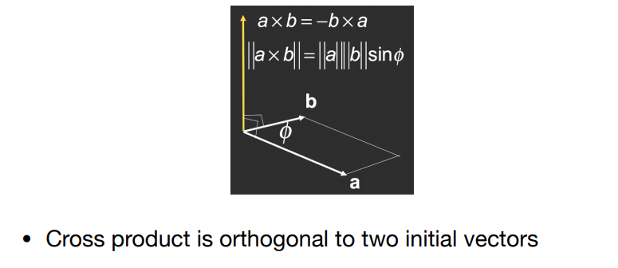

向量a叉乘向量b获得一个垂直于向量a和b的新向量,新向量的方向依赖于叉乘顺序和坐标系的选择(左手或者是右手坐标系).

### **叉乘满足的性质:**

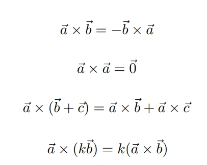

注意:向量a与自身等等叉乘是一个大小为0的向量.

### **叉乘的计算:**

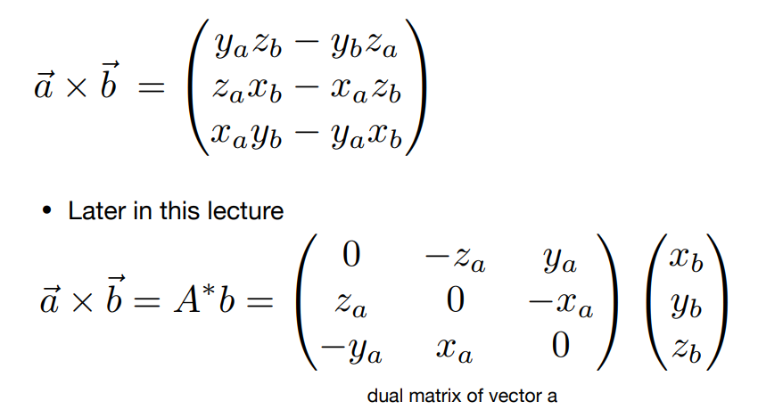

### **叉乘的运用**

1.决定是在左还是右

->确认是否在内部

# 4.规范正交基底

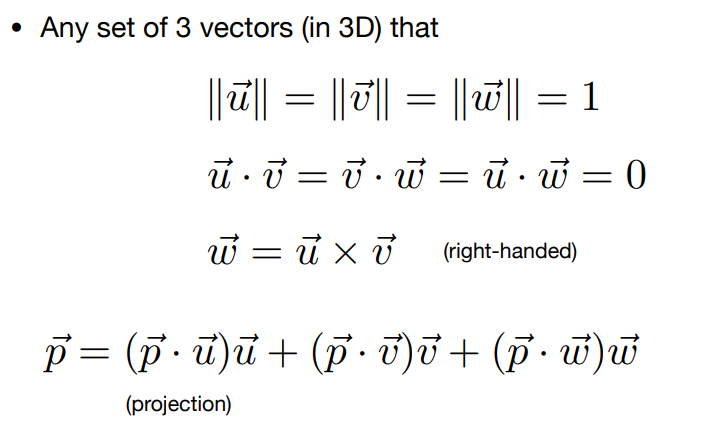

**任意三组向量满足,向量的长度为1,向量之间点乘为0(垂直),第三个向量由另外两个向量叉乘获得**

**则向量可以用这组规模正交基底表示,表示为向量在每个规范正交基底上的投影**