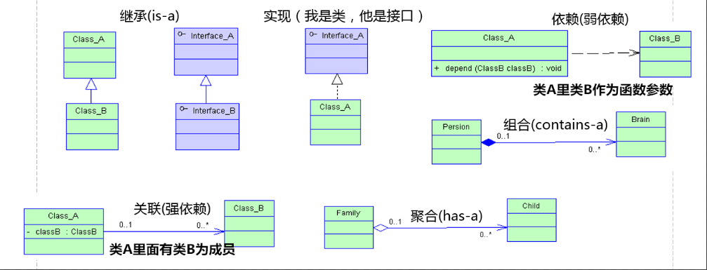

# 六大关系

 

**继承**:表示实线+空心三角形,继承关系

**实现**:表示虚线+空心三角形,类实现接口

**依赖**:表示虚线+箭头,具体情况如果两个类是**同级关系**,其中B类作为A类的**局部变量**

**关联**:表示实线+箭头,具体情况如果两个类是**同级关系**,其中B类作为A类的**全局变量**

**聚合**:表示实线+空心菱形,具体情况如果两个类是**非同级关系**,B类作为A类的全局变量,和A类**可以具有不同的生命周期**(eg.家庭一开始没有孩子)

**组合**:表示实线+实心菱形,具体情况如果两个类是**非同级关系**,B类作为A类的全局变量,和A类**具有相同的生命周期**(eg.人出生就有大脑)

## Tip

依赖->关联->聚合->组合,强度递增