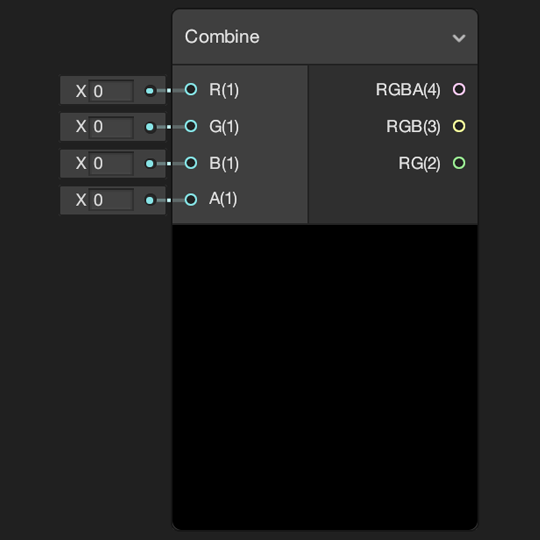
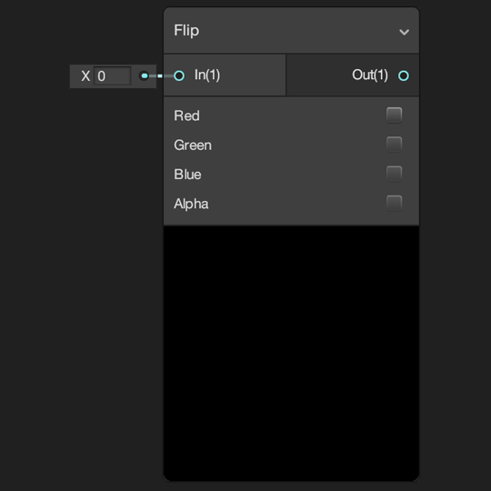
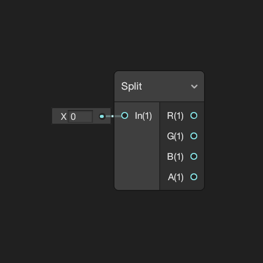
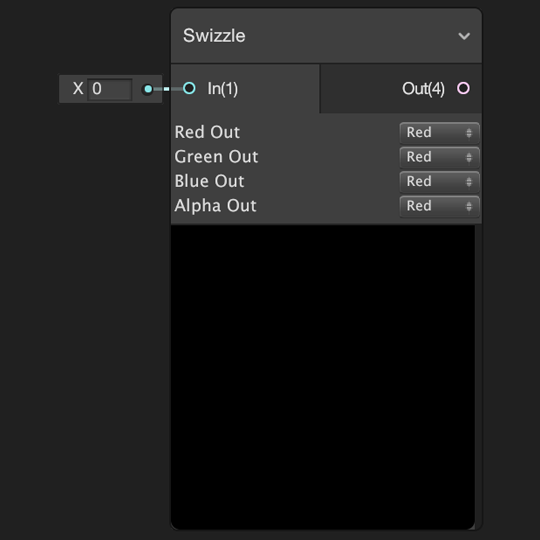
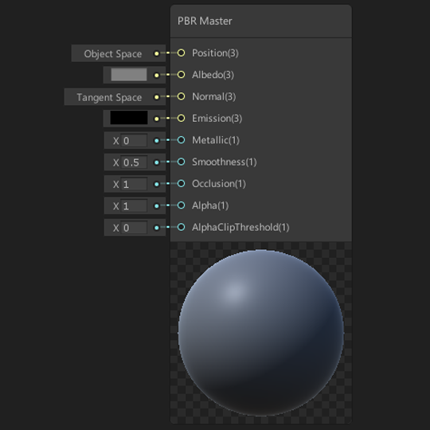
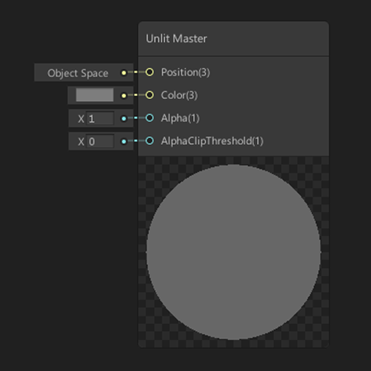

# Node Library

## Atistic

## Channel(通道操作)

### Combine(组合)

**描述**

Creates new vectors from the four inputs **R**, **G**, **B** and **A**. Output **RGBA** is a **Vector 4** composed of inputs **R**, **G**, **B** and **A**. Output **RGB** is a **Vector 3** composed of inputs **R**, **G** and **B**. Output **RG** is a **Vector 2** composed of inputs **R** and **G**.

从输入R,G,B,A中组合出新的输出向量,4维输出向量RGBA由输入R,G,B,A组成,3维输出向量RGB由输入R,G,B,组成,2维输出向量RG由输入R,G组成

**Ports**

| Name | Direction | Type     | Binding | Description                     |
| :--- | :-------- | :------- | :------ | :------------------------------ |
| R    | Input     | Vector 1 | None    | Defines red channel of output   |
| G    | Input     | Vector 1 | None    | Defines green channel of output |
| B    | Input     | Vector 1 | None    | Defines blue channel of output  |
| A    | Input     | Vector 1 | None    | Defines alpha channel of output |
| RGBA | Output    | Vector 4 | None    | Output value as **Vector 4**    |
| RGB  | Output    | Vector 3 | None    | Output value as **Vector 3**    |
| RG   | Output    | Vector 2 | None    | Output value as **Vector 2**    |

### Flip(翻转)

**描述**

Flips the individual channels of input **In** selected by the [Node](https://docs.unity3d.com/Packages/com.unity.shadergraph@6.9/manual/Node.html)'s parameters. Positive values become negative values and vice versa.

选择通道进行翻转,正值翻转为负值,反之同理

注意:输入的维度决定可以使用的控制开关,例如3维无法使用alpha通道(4维)

**Ports**

| Name | Direction | Type           | Binding | Description  |
| :--- | :-------- | :------------- | :------ | :----------- |
| In   | Input     | Dynamic Vector | None    | Input value  |
| Out  | Output    | Dynamic Vector | None    | Output value |

**Controls**

| Name  | Type   | Options     | Description                                                  |
| :---- | :----- | :---------- | :----------------------------------------------------------- |
| Red   | Toggle | True, False | If true red channel will be flipped.                         |
| Green | Toggle | True, False | If true green channel will be flipped. Disabled if **In** is Vector 1. |
| Blue  | Toggle | True, False | If true blue channel will be flipped. Disabled if **In** is Vector 2 or smaller. |
| Alpha | Toggle | True, False | If true alpha channel will be flipped. Disabled if **In** is Vector 3 or smaller. |

### Split(分裂)

**描述**

Splits the input vector **In** into four **Vector 1** outputs **R**, **G**, **B** and **A**. These output vectors are defined by the individual channels of the input **In**; red, green, blue and alpha respectively. If the input vector **In**'s dimension is less than 4 (**Vector 4**) the output values not present in the input will be 0.

将输入向量分解为单独的R,G,B,A通道,如果输入的向量维度小于4,则无法表达的通道将被设置为0

**Ports**

| Name | Direction | Type           | Binding | Description              |
| :--- | :-------- | :------------- | :------ | :----------------------- |
| In   | Input     | Dynamic Vector | None    | Input value              |
| R    | Output    | Vector 1       | None    | Red channel from input   |
| G    | Output    | Vector 1       | None    | Green channel from input |
| B    | Output    | Vector 1       | None    | Blue channel from input  |
| A    | Output    | Vector 1       | None    | Alpha channel from input |

### Swizzle(重新排序)

**描述**

Creates a new vector of the same dimension as the input vector. The channels of the output vector are the same as the input vector but re-ordered by the dropdown parameters on the node. This is called swizzling.

Channel dropdown parameters are dynamic depending on the length of the input vector's dimension. Dropdowns for channels that are not present will be disabled and dropdowns will only contain entries for channels that exist in the vector.

生成一个和输入向量相同维度的输出向量,但输出向量的RGBA通道可以通过下拉菜单来重新选择

下拉菜单中只包含输入向量实际拥有的通道

**Ports**

| Name | Direction | Type           | Binding | Description  |
| :--- | :-------- | :------------- | :------ | :----------- |
| In   | Input     | Dynamic Vector | None    | Input value  |
| Out  | Output    | Dynamic Vector | None    | Output value |

**Controls**

| Name      | Type     | Options                                                      | Description                                                  |
| :-------- | :------- | :----------------------------------------------------------- | :----------------------------------------------------------- |
| Red out   | Dropdown | Red, Green, Blue, Alpha (depending on input vector dimension) | Defines which input channel should be used in the output's red channel |
| Green out | Dropdown | Red, Green, Blue, Alpha (depending on input vector dimension) | Defines which input channel should be used in the output's green channel |
| Blue out  | Dropdown | Red, Green, Blue, Alpha (depending on input vector dimension) | Defines which input channel should be used in the output's blue channel |
| Alpha out | Dropdown | Red, Green, Blue, Alpha (depending on input vector dimension) | Defines which input channel should be used in the output's alpha channel |

## Input

## Master(主节点)

### PBRMaster

**描述**

A [Master Node](https://docs.unity3d.com/Packages/com.unity.shadergraph@6.9/manual/Master-Node.html) for physically based rendering. Can be used in either **Metallic** or **Specular** workflow modes as defined by the **Workflow** dropdown parameter.

Values supplied to the input **Normal** are expected to be in tangent space. Use the [Transform Node](https://docs.unity3d.com/Packages/com.unity.shadergraph@6.9/manual/Transform-Node.html) to convert to tangent space.

基于PBR的主节点,在**Metallic**(金属) 或者 **Specular** (高光)工作流中使用,法线端口的输入值,需要将法线转换为切线空间

**Ports**

| Name                               | Direction | Type     | Stage    | Binding              | Description                                                  |
| :--------------------------------- | :-------- | :------- | :------- | :------------------- | :----------------------------------------------------------- |
| Position                           | Input     | Vector 3 | Vertex   | None                 | Defines the absolute object space vertex position per vertex |
| Albedo(漫反射系数)                 | Input     | Vector 3 | Fragment | None                 | Defines material's albedo value. **Expected range 0 - 1.**   |
| Normal(法线)                       | Input     | Vector 3 | Fragment | Tangent Space Normal | Defines material's normal value. **Expects normals in tangent space.** |
| Emission(自发光)                   | Input     | Vector 3 | Fragment | None                 | Defines material's emission color value. **Expects positive values.** |
| Metallic(金属程度)                 | Input     | Vector 1 | Fragment | None                 | Defines material's metallic value **where 0 is non-metallic and 1 is metallic. Only available in Metallic Workflow mode.** |
| Specular(高光)                     | Input     | Vector 3 | Fragment | None                 | Defines material's specular color value. **Expected range 0 - 1.Only available in Specular Workflow mode.** |
| Smoothness(平滑程度)               | Input     | Vector 1 | Fragment | None                 | Defines material's smoothness value. **Expected range 0 - 1.** |
| Occlusion(环境遮蔽值)              | Input     | Vector 1 | Fragment | None                 | Defines material's ambient occlusion value. **Expected range 0 - 1.** |
| Alpha(透明度)                      | Input     | Vector 1 | Fragment | None                 | Defines material's alpha value. Used for transparency and/or alpha clip. **Expected range 0 - 1.** |
| Alpha Clip Threshold(透明度丢弃值) | Input     | Vector 1 | Fragment | None                 | Fragments with an alpha below this value will be discarded. Requires a node connection. **Expected range 0 - 1.** |

**Material Options**(材质选项)

点击节点右上角的齿轮图标

| Name      | Type     | Options                                | Description                                                |
| :-------- | :------- | :------------------------------------- | :--------------------------------------------------------- |
| Workflow  | Dropdown | Metallic, Specular                     | Defines workflow mode for the material                     |
| Surface   | Dropdown | Opaque, Transparent                    | Defines if the material is transparent                     |
| Blend     | Dropdown | Alpha, Premultiply, Additive, Multiply | Defines blend mode of a transparent material               |
| Two Sided | Toggle   | True, False                            | If true both front and back faces of the mesh are rendered |

### UnlitMaster

**Description**

A [Master Node](https://docs.unity3d.com/Packages/com.unity.shadergraph@6.9/manual/Master-Node.html) for unlit materials.

主节点对于无光照材质

**Ports**

| Name                 | Direction | Type     | Stage    | Binding | Description                                                  |
| :------------------- | :-------- | :------- | :------- | :------ | :----------------------------------------------------------- |
| Position             | Input     | Vector 3 | Vertex   | None    | Defines the absolute object space vertex position per vertex |
| Color                | Input     | Vector 3 | Fragment | None    | Defines material's color value. **Expected range 0 - 1.**    |
| Alpha                | Input     | Vector 1 | Fragment | None    | Defines material's alpha value. Used for transparency and/or alpha clip. **Expected range 0 - 1**. |
| Alpha Clip Threshold | Input     | Vector 1 | Fragment | None    | Fragments with an alpha below this value will be discarded. Requires a node connection. **Expected range 0 - 1.** |

**Material Options**(材质选项)

点击节点右上角的齿轮图标

| Name      | Type     | Options                                | Description                                                |
| :-------- | :------- | :------------------------------------- | :--------------------------------------------------------- |
| Surface   | Dropdown | Opaque, Transparent                    | Defines if the material is transparent                     |
| Blend     | Dropdown | Alpha, Premultiply, Additive, Multiply | Defines blend mode of a transparent material               |
| Two Sided | Toggle   | True, False                            | If true both front and back faces of the mesh are rendered |

## Procedural

## Utility

## UV

