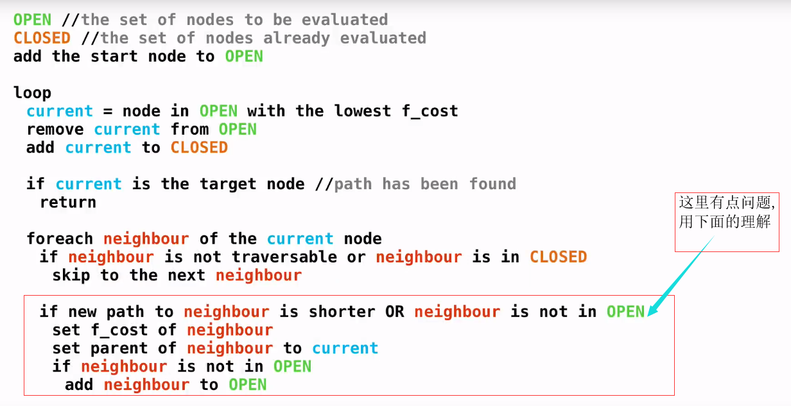

# A星寻路

1.需要一个open表和一个closed表,一个存贮当前选择的节点的节点数据结构

2.一种节点数据结构:能够记录节点的F值,G值,H值,还有节点的父节点

其中F(总开销)=G(到起点的距离)+H(到终点的距离)

**解析:**(这个版本会重新计算G值)

1.清空open表和closed表,以及当前选择的节点

2.把起点加入open表中(现在表中只有一个节点)

3.进入循环

 		将当前节点设置为open表中F值最小的点,并将这个点从open表中删除并加入closed表

  		如果当前节点是终点->return

  				判断当前节点周围的邻居节点,进入循环

​						1.如果这个邻居是不可达的,或者在closed表中

​								不做处理跳过

​						2.如果这个邻居节点不在open表中

​								添加进open表

​								计算邻居节点的值

​								设置这个邻居节点的父节点为当前节点

​						3.计算邻居节点的值(这步计算是否有更短路径到这个邻居节点)(不需要重新计算的情况下可以不算)

​								如果当前节点G值+到邻居节点的开销,小于邻居节点当前的G值存储

​										则邻居节点的G值等于当前节点的G值+当前节点到邻居节点的开销

​										并重新计算F值

​										设置这个邻居节点的父节点为当前节点

​				循环结束

4.循环结束

**优化:**

openg表可以通过堆排序来优化选取