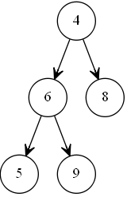
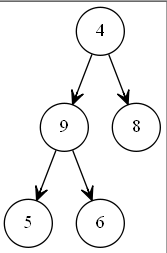
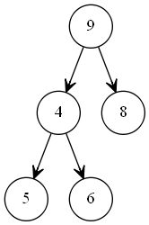
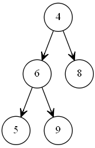
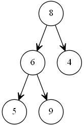
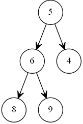
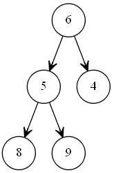
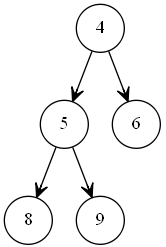

# 堆排序

```C++
#include <iostream>
using namespace std;

void max_heap(int a[],int begin,int end )
{
    int dad=begin;//父节点标识位
    int son=dad*2+1;//子节点标识位
    while (son<=end) {
        if (son+1<=end&&a[son]<a[son+1]) {//从两个子节点中选择最大的一个
            son++;
        }
        if (a[dad]>a[son]) {//如果父节点大与最大的那个子节点则退出
            return;
        }
        else
        {
            swap(a[dad], a[son]);//否则就交互父节点的值与子节点的值
            dad=son;//重新设置索引对孙子节点进行比较
            son=dad*2+1;
        }
    }
}

void heap_sort(int a[],int len)
{
    for (int i=len/2-1; i>=0; i--) {
        max_heap(a, i, len-1);//构建最大堆
    }
    for (int i=len-1; i>0; i--) {
        swap(a[i], a[0]);//交换最后一个元素与第一个元素
        max_heap(a, 0, i-1);//除去最后一个元素,重新构建最大堆
    }
}

int main(int argc, const char * argv[]) {
    // insert code here...
    int arr[]={4,6,8,5,9};
    int len = (int) sizeof(arr) / sizeof(*arr); 
  	//sizeof(arr)=每个元素的大小*数量
  	//sizeof(*arr)=每个元素的大小
    cout<<len<<endl;				
    for (int i=0; i<len; i++) {
        cout<<arr[i]<<" ";
    }
    cout<<endl;
    heap_sort(arr,len);
    for (int i=0; i<len; i++) {
        cout<<arr[i]<<" ";
    }
    cout<<endl;
    return 0;
}

```

## 1.堆排序

堆排序是利用**堆**这种数据结构而设计的一种排序算法，堆排序是一种**选择排序，**它的**最坏，最好，平均时间复杂度均为O(nlogn)**，它也是不稳定排序。

**堆结构**

　　堆是具有以下性质的**完全二叉树**：每个结点的值都大于或等于其左右孩子结点的值，称为**最大堆**；或者每个结点的值都小于或等于其左右孩子结点的值，称为**最小堆**。

## 2.堆排序的基本思路

　　1.将无需序列构建成一个最大堆(最小堆)，根据升序降序需求选择;

​		ps.最大堆也称为(大顶堆),最小堆也称为(小顶堆)

　　2.将堆顶元素与末尾元素交换，将最大元素"沉"到数组末端;

　　3.重新调整结构，使其满足堆定义，然后继续交换堆顶元素与当前末尾元素，反复执行调整+交换步骤，直到整个序列有序。

## 3.代码解析

树可以用数组来表示,我们用数组表示一个堆结构，我们用简单的公式来描述一下堆的定义就是：

**大顶堆：arr[i] >= arr[2i+1] && arr[i] >= arr[2i+2]**  

**小顶堆：arr[i] <= arr[2i+1] && arr[i] <= arr[2i+2]** 

1.先构建一个无序的堆



2.将这个无序的堆调整成一个最大堆

我们从最后一个非叶子结点开始（叶结点自然不用调整，第一个非叶子结点 arr.length/2-1=5/2-1=1,也就是上面的6结点）,从左至右，从下至上进行调整。父节点的6小于作为子节点的9,所以6,9节点互换.得到



找到第二个非叶节点4，由于[4,9,8]中9元素最大，4和9交换,得到



这时,交换导致了子根[4,5,6]结构混乱，继续调整，[4,5,6]中6最大，交换4和6,得到


此时最大堆已经完成

3.将堆顶元素与末尾元素进行交换,使末尾元素最大.然后继续调整堆,再将堆顶元素与末尾元素交换,得到第二大元素.如此反复进行交换,重建,交换.



重新构建除去最后一个元素外的最大堆



再将堆顶元素8与末尾元素5进行交换，得到第二大元素8.



然后重新排序



重复这个过程,最后得到



此时整个序列有序

参考文献:

1.[https://baike.baidu.com/item/%E5%A0%86%E6%8E%92%E5%BA%8F/2840151?fr=aladdin#3_2](https://baike.baidu.com/item/堆排序/2840151?fr=aladdin#3_2)

2.https://www.cnblogs.com/chengxiao/p/6129630.html