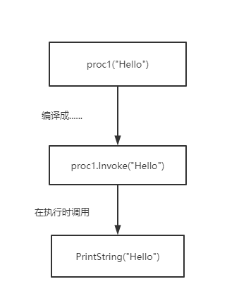

# 委托

## C#1

### 简单委托的构成

1.声明委托类型

2.必须有一个方法包含了要执行的代码

3.必须创建一个委托实例

4.必须调用委托实例

#### 1.声明委托类型

委托类型实际上只是参数类型的一个列表以及一个返回类型.它规定了类型的实例能表示的操作.

例如:delegate void StringProcessor(string input);

上述代码指出,如果要创建stringProcessor的一个实例,需要只带一个参数(一个字符串)的方法,而且这个方法要有一个vo1d返回类型( 该方法什么都不返回).  也就是普通的函数声明前面+一个delegate关键字,但此时的函数名其实是委托类型的名字,类比于class

#### 2.必须有一个方法包含了要执行的代码

基本思路是找到一个方法,它能做完美想做的事情,同事具有和委托类型相同的签名.确保在调用一个委托实例的时候,使用的参数完全匹配,而且能以完美希望的方式(就像普通方法调用)使用返回值. 也就是说函数的签名要和委托的签名相同,相同的返回值,相同的输入参数类型,个数.但函数名无所谓

#### 3.必须创建一个委托实例

StringProcessor proc1,proc2;
proc1=new StringProcessor(StaticMethods.PrintString)
InstanceMethods instance=new InstanceMethods();
proc2=new StringProcessor(insance.printString);

 根据第一步创建的委托类型(函数名),也就把委托类型理解成class那样,创建一个委托实例.

 在构建时传入与委托签名,相同的函数.静态函数就直接写入,实例函数就先声明一个实例然后调用函数

#### 4.必须调用委托实例

在这个例子中,有一个像下面这样的方法

void Invoke(string input)

调用Invoke会执行委托实例的操作,向它传递在调用Invoke时指定的任何参数.另外,如果返回类型不是void,还要返回操作的返回值.是不是很简单? C#将这个过程变得更简单一如果有一个委托类型的变量,就可以把它视为方法本身.观察由不同时间发生的事件构成的一个事件链,很容易就可以理解这一点, 如图所示.

也就是委托实例proc1可以被视为一个方法,方法接受的参数类型,个数与委托签名中参数类型个数一致,然后在通过编译后会被编译成通过invoke进行调用.最后实际执行时是执行第三步注册进委托实例的方法

### 合并和删除委托

在真实情况下委托实例不仅仅只含有一个操作,通常要复杂一些会含有更多的操作,委托实例实际有一个操作列表与之关联,这称为委托实例的调用列表(invocation list).

这种委托可以包含有多个函数的,称为为多路委托(multicastdelegate),例如在第一步中的StringProcessor实际上是继承于System.MulticastDelegate,而System.Multicastdelegate又实际上继承于System.Delegate

在System.Delegate类型中的静态方法Combine和Remove负责删除和创建新的委托实例,其中, Combine负责将两个委托实例的调用列表连接到一起,而Remove负责从-一个委托实例中删除另一个实例的调用列表.

**委托是不易变的**:创建了委托实例后,有关它的一切就不能改变.这样一来,就可以安全地传递委托实例的引用同时不必担心一致性、线程安全性或者是否有其他人试图更改它..
对委托进行的合并:实际上是将两个委托实例的调用列表被连接到一起,产生一个新的实例(对象).
而删减:从一个委托实例的调用列表中删减另一个委托实例的调用列表,同样最后要产生一个新的实例(对象)

在这一点上,委托实例和string是一样的.string的裁剪分割组合都是产生一个新的string对象,而不会对原string做修改

注意,如果试圈将null和委托实例合并到一起,nul1将被视为带有空调用列表的一个委托.

回到System.Delegate类型中Combine和Remove方法,一般不会显示调用这两个方法来组合或者删减委托的调用列表,而是通过+=或-=操作符,这种转换一般由编辑器完成.

proc1+=Console.WriteLine;
proc2-=Console.WriteLine;

调用委托实例时，它的所有操作都顺序执行。如果委托的签名具有一个非void的返回类型，则Invoke的返回值是最后一个方法的返回值。很少有非vo1d的委托实例在它的调用列表中指定多个操作，因为这意味着其他所有操作的返回值永远都看不见。除非每次调用代码使用Delegate.GetInvocationList(该方法返回一个Delegate数组,数组中的每个元素代表调用列表中的方法)获取操作列表时，都显式调用某个方法。委托只返回最后一个方法的返回值

如果调用列表中的任何方法中抛出一个异常,都会阻止执行后续的操作。例如，假定调用一个委托实例，它的操作列表是[a, b, c],但操作b抛出了一个异常，这个异常会立即“传播”，操作c不会执行。在调用列表产生的异常会中断委托的继续执行